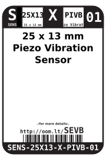
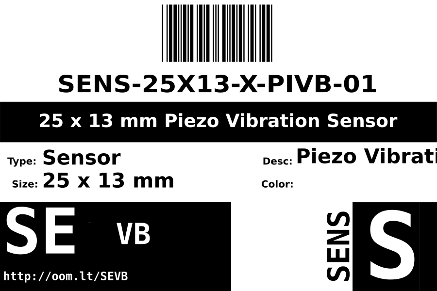

Contents
========

* [SENS-25X13-X-PIVB-01>25 x 13 mm Piezo Vibration Sensor](#sens-25x13-x-pivb-0125-x-13-mm-piezo-vibration-sensor)
	* [Datasheets](#datasheets)
	* [Labels](#labels)
	* [EDA](#eda)
		* [Symbols](#symbols)
	* [Tags](#tags)

# SENS-25X13-X-PIVB-01>25 x 13 mm Piezo Vibration Sensor

- ID: SENS-25X13-X-PIVB-01
- Name: SENS-25X13-X-PIVB-01

## Datasheets

- Datasheet: [datasheet.pdf](datasheet.pdf)

## Labels
  
  

|Front|Inventory|Specifications|
| :---: | :---: | :---: |
||||

## EDA

### Symbols

## Tags

- hexID: SEVB
- oompSort: SENS25X13PIVB
- oompType: SENS
- oompSize: 25X13
- oompColor: X
- oompDesc: PIVB
- oompIndex: 01
- oompVersion: 98
- ooWidth: 25 mm
- ooLength: 13 mm
