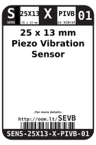
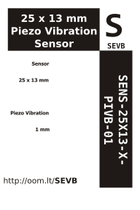

Contents
========

* [SEVB > 25 x 13 mm Piezo Vibration Sensor](#sevb--25-x-13-mm-piezo-vibration-sensor)
	* [Datasheets](#datasheets)
	* [Labels](#labels)
	* [EDA](#eda)
	* [Images](#images)
	* [Tags](#tags)

# SEVB > 25 x 13 mm Piezo Vibration Sensor

- ID: SENS-25X13-X-PIVB-01
- Hex ID: SEVB
- Name: 25 x 13 mm Piezo Vibration Sensor
- Description: 25 x 13 mm Piezo Vibration Sensor
- Long Link: [http://oom.lt/SENS-25X13-X-PIVB-01](http://oom.lt/SENS-25X13-X-PIVB-01)
- Short Link: [http://oom.lt/SEVB](http://oom.lt/SEVB)

## Datasheets

- Datasheet: [datasheet.pdf](datasheet.pdf)

## Labels
  
  

|label-front|label-inventory|label-spec|
| :---: | :---: | :---: |
||||

## EDA

## Images
  
  

|label-front|label-inventory|label-spec|
| :---: | :---: | :---: |
||||

## Tags

- oompID: SENS-25X13-X-PIVB-01
- name: 25 x 13 mm Piezo Vibration Sensor
- hexID: SEVB
- oompSort: SENS25X13PIVB
- oompType: SENS
- oompSize: 25X13
- oompColor: X
- oompDesc: PIVB
- oompIndex: 01
- oompVersion: 98
- ooWidth: 25 mm
- ooLength: 13 mm
