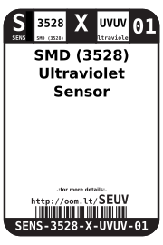

Contents
========

* [SENS-3528-X-UVUV-01>SMD (3528) Ultraviolet Sensor](#sens-3528-x-uvuv-01smd-3528-ultraviolet-sensor)
	* [Datasheets](#datasheets)
	* [Labels](#labels)
	* [EDA](#eda)
		* [Symbols](#symbols)
	* [Tags](#tags)

# SENS-3528-X-UVUV-01>SMD (3528) Ultraviolet Sensor

- ID: SENS-3528-X-UVUV-01
- Name: SENS-3528-X-UVUV-01

## Datasheets

- Datasheet: [datasheet.pdf](datasheet.pdf)

## Labels
  
  

|Front|Inventory|Specifications|
| :---: | :---: | :---: |
||||

## EDA

### Symbols

## Tags

- hexID: SEUV
- oompSort: SENS3528UVUV
- oompType: SENS
- oompSize: 3528
- oompColor: X
- oompDesc: UVUV
- oompIndex: 01
- oompVersion: 98
- ooNumPins: 2
- ooDesignator: U1
