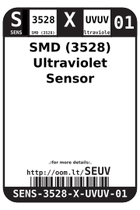
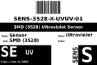
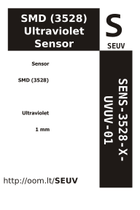

Contents
========

* [SEUV > SMD (3528) Ultraviolet Sensor](#seuv--smd-3528-ultraviolet-sensor)
	* [Datasheets](#datasheets)
	* [Labels](#labels)
	* [EDA](#eda)
	* [Images](#images)
	* [Tags](#tags)

# SEUV > SMD (3528) Ultraviolet Sensor

- ID: SENS-3528-X-UVUV-01
- Hex ID: SEUV
- Name: SMD (3528) Ultraviolet Sensor
- Description: SMD (3528) Ultraviolet Sensor
- Long Link: [http://oom.lt/SENS-3528-X-UVUV-01](http://oom.lt/SENS-3528-X-UVUV-01)
- Long Link: [http://oom.lt/SEUV](http://oom.lt/SEUV)

## Datasheets

- Datasheet: [datasheet.pdf](datasheet.pdf)

## Labels
  
  

|label-front|label-inventory|label-spec|
| :---: | :---: | :---: |
||||

## EDA

### Symbols

## Images
  
  

|label-front|label-inventory|label-spec|
| :---: | :---: | :---: |
||||

## Tags

- oompID: SENS-3528-X-UVUV-01
- name: SMD (3528) Ultraviolet Sensor
- hexID: SEUV
- oompSort: SENS3528UVUV
- oompType: SENS
- oompSize: 3528
- oompColor: X
- oompDesc: UVUV
- oompIndex: 01
- oompVersion: 98
- ooNumPins: 2
- ooDesignator: U1
