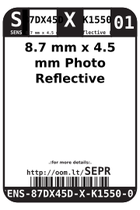
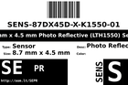

Contents
========

* [SEPR > 8.7 mm x 4.5 mm Photo Reflective (LTH1550) Sensor](#sepr--87-mm-x-45-mm-photo-reflective-lth1550-sensor)
	* [Images](#images)
	* [Datasheets](#datasheets)
	* [Labels](#labels)
	* [EDA](#eda)
	* [Tags](#tags)

# SEPR > 8.7 mm x 4.5 mm Photo Reflective (LTH1550) Sensor

- ID: SENS-87DX45D-X-K1550-01
- Hex ID: SEPR
- Name: 8.7 mm x 4.5 mm Photo Reflective (LTH1550) Sensor
- Description: 8.7 mm x 4.5 mm Photo Reflective (LTH1550) Sensor

## Images
  
  

|label-front|label-inventory|label-spec|
| :---: | :---: | :---: |
||||

## Datasheets

- Datasheet: [datasheet.pdf](datasheet.pdf)

## Labels
  
  

|label-front|label-inventory|label-spec|
| :---: | :---: | :---: |
||||

## EDA

### Symbols

## Tags

- oompID: SENS-87DX45D-X-K1550-01
- name: 8.7 mm x 4.5 mm Photo Reflective (LTH1550) Sensor
- hexID: SEPR
- oompSort: SENS87DX45DK1550
- oompType: SENS
- oompSize: 87DX45D
- oompColor: X
- oompDesc: K1550
- oompIndex: 01
- oompVersion: 98
- ooWidth: 4.5 mm
- ooLength: 8.7 mm
- ooDesignator: U
