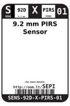
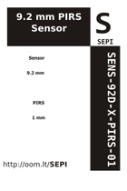

Contents
========

* [SEPI > 9.2 mm PIRS Sensor](#sepi--92-mm-pirs-sensor)
	* [Images](#images)
	* [Datasheets](#datasheets)
	* [Labels](#labels)
	* [EDA](#eda)
	* [Tags](#tags)

# SEPI > 9.2 mm PIRS Sensor

- ID: SENS-92D-X-PIRS-01
- Hex ID: SEPI
- Name: 9.2 mm PIRS Sensor
- Description: 9.2 mm PIRS Sensor

## Images
  
  

|label-front|label-inventory|label-spec|
| :---: | :---: | :---: |
||||

## Datasheets

- Datasheet: [datasheet.pdf](datasheet.pdf)

## Labels
  
  

|label-front|label-inventory|label-spec|
| :---: | :---: | :---: |
||||

## EDA

### Symbols

## Tags

- oompID: SENS-92D-X-PIRS-01
- name: 9.2 mm PIRS Sensor
- hexID: SEPI
- oompSort: SENS92DPIRS
- oompType: SENS
- oompSize: 92D
- oompColor: X
- oompDesc: PIRS
- oompIndex: 01
- oompVersion: 98
- ooDiameter: 9.2 mm
- ooNumPins: 2
- ooDesignator: 0
