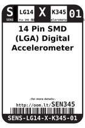
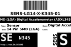

Contents
========

* [SEN345 > 14 Pin SMD (LGA) Digital Accelerometer (ADXL345) Sensor](#sen345--14-pin-smd-lga-digital-accelerometer-adxl345-sensor)
	* [Datasheets](#datasheets)
	* [Labels](#labels)
	* [EDA](#eda)
	* [Images](#images)
	* [Tags](#tags)
  
![][im]
# SEN345 > 14 Pin SMD (LGA) Digital Accelerometer (ADXL345) Sensor

- ID: SENS-LG14-X-K345-01
- Hex ID: SEN345
- Name: 14 Pin SMD (LGA) Digital Accelerometer (ADXL345) Sensor
- Description: 14 Pin SMD (LGA) Digital Accelerometer (ADXL345) Sensor
- Long Link: [http://oom.lt/SENS-LG14-X-K345-01](http://oom.lt/SENS-LG14-X-K345-01)
- Short Link: [http://oom.lt/SEN345](http://oom.lt/SEN345)

## Datasheets

- Datasheet: [datasheet.pdf](datasheet.pdf)

## Labels
  
  

|label-front|label-inventory|label-spec|
| :---: | :---: | :---: |
||||

## EDA

## Images
  
  

|image|image_RE|image_BOTTOM|label-front|label-inventory|label-spec|
| :---: | :---: | :---: | :---: | :---: | :---: |
|||||||

## Tags

- oompType: SENS
- oompSize: LG14
- oompColor: X
- oompDesc: K345
- oompIndex: 01
- hexID: SEN345
- oompID: SENS-LG14-X-K345-01

[im]: image_450.jpg
