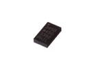
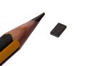

Contents
========

* [SEN345 > ](#sen345--)
	* [Datasheets](#datasheets)
	* [Labels](#labels)
	* [EDA](#eda)
	* [Images](#images)
	* [Tags](#tags)
  
![][im]
# SEN345 > 

- ID: SENS-LG14-X-K345-01
- Hex ID: SEN345
- Name: 
- Description: 
- Long Link: [http://oom.lt/SENS-LG14-X-K345-01](http://oom.lt/SENS-LG14-X-K345-01)
- Short Link: [http://oom.lt/SEN345](http://oom.lt/SEN345)

## Datasheets

- Datasheet: [datasheet.pdf](datasheet.pdf)

## Labels
  
  

|label-front|label-inventory|label-spec|
| :---: | :---: | :---: |
||||

## EDA

### Footprints
  

|[  FOOTPRINT-kicad-kicad-footprints-Package_LGA-LGA-14_3x5mm_P0.8mm_LayoutBorder1x6y](https://github.com/oomlout/oomlout_OOMP_eda/tree/main/FOOTPRINT/kicad/kicad-footprints/Package_LGA/LGA-14_3x5mm_P0.8mm_LayoutBorder1x6y/)||||
| :---: | :---: | :---: | :---: |

### Symbols
  

|[  SYMBOL-kicad-kicad-symbols-Sensor_Motion-ADXL343](https://github.com/oomlout/oomlout_OOMP_eda/tree/main/SYMBOL/kicad/kicad-symbols/Sensor_Motion/ADXL343/)||||
| :---: | :---: | :---: | :---: |

## Images
  
  

|image|image_RE|image_BOTTOM|label-front|label-inventory|label-spec|
| :---: | :---: | :---: | :---: | :---: | :---: |
|||||||

## Tags

- oompType: SENS
- oompSize: LG14
- oompColor: X
- oompDesc: K345
- oompIndex: 01
- hexID: SEN345
- oompID: SENS-LG14-X-K345-01
- footprintKicad: FOOTPRINT-kicad-kicad-footprints-Package_LGA-LGA-14_3x5mm_P0.8mm_LayoutBorder1x6y
- symbolKicad: SYMBOL-kicad-kicad-symbols-Sensor_Motion-ADXL343

[im]: image_450.jpg
