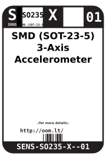
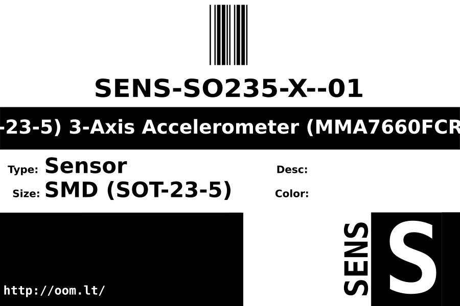
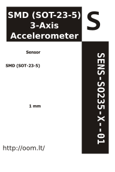

Contents
========

* [SENS-SO235-X--01>SMD (SOT-23-5) Sensor](#sens-so235-x--01smd-sot-23-5-sensor)
	* [Datasheets](#datasheets)
	* [Labels](#labels)
	* [EDA](#eda)
		* [Symbols](#symbols)
	* [Tags](#tags)

# SENS-SO235-X--01>SMD (SOT-23-5) Sensor

- ID: SENS-SO235-X--01
- Name: SENS-SO235-X--01

## Datasheets

- Datasheet: [datasheet.pdf](datasheet.pdf)

## Labels
  
  

|Front|Inventory|Specifications|
| :---: | :---: | :---: |
||||

## EDA

### Symbols

## Tags

- oompType: SENS
- oompSize: SO235
- oompColor: X
- oompIndex: 01
- oompVersion: 999
