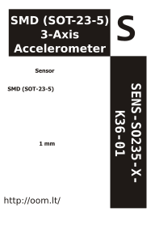

Contents
========

* [SENS-SO235-X-K36-01>SMD (SOT-23-5) 3-Axis Accelerometer (MMA7660FCR1) Sensor](#sens-so235-x-k36-01smd-sot-23-5-3-axis-accelerometer-mma7660fcr1-sensor)
	* [Labels](#labels)
	* [EDA](#eda)
		* [Symbols](#symbols)
	* [Tags](#tags)

# SENS-SO235-X-K36-01>SMD (SOT-23-5) 3-Axis Accelerometer (MMA7660FCR1) Sensor

- ID: SENS-SO235-X-K36-01
- Name: SENS-SO235-X-K36-01

## Labels
  
  

|label-front|label-inventory|label-spec|
| :---: | :---: | :---: |
||||

## EDA

### Symbols

## Tags

- oompID: SENS-SO235-X-K36-01
- name: SMD (SOT-23-5) 3-Axis Accelerometer (MMA7660FCR1) Sensor
- oompType: SENS
- oompSize: SO235
- oompColor: X
- oompIndex: 01
- oompVersion: 999
