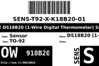

Contents
========

* [OW918B20 > TO-92 DS18B20 (1-Wire Digital Thermometer) Sensor](#ow918b20--to-92-ds18b20-1-wire-digital-thermometer-sensor)
	* [Datasheets](#datasheets)
	* [Labels](#labels)
	* [EDA](#eda)
	* [Images](#images)
	* [Tags](#tags)

# OW918B20 > TO-92 DS18B20 (1-Wire Digital Thermometer) Sensor

- ID: SENS-T92-X-K18B20-01
- Hex ID: OW918B20
- Name: TO-92 DS18B20 (1-Wire Digital Thermometer) Sensor
- Description: TO-92 DS18B20 (1-Wire Digital Thermometer) Sensor
- Long Link: [http://oom.lt/SENS-T92-X-K18B20-01](http://oom.lt/SENS-T92-X-K18B20-01)
- Short Link: [http://oom.lt/OW918B20](http://oom.lt/OW918B20)

## Datasheets

- Datasheet: [datasheet.pdf](datasheet.pdf)

## Labels
  
  

|label-front|label-inventory|label-spec|
| :---: | :---: | :---: |
||||

## EDA

### Symbols

## Images
  
  

|label-front|label-inventory|label-spec|
| :---: | :---: | :---: |
||||

## Tags

- oompType: SENS
- oompSize: T92
- oompColor: X
- oompDesc: K18B20
- oompIndex: 01
- hexID: OW918B20
- oompID: SENS-T92-X-K18B20-01
