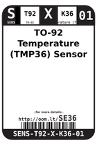
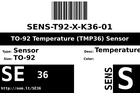
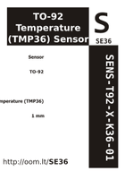

Contents
========

* [SE36 > TO-92 Temperature (TMP36) Sensor](#se36--to-92-temperature-tmp36-sensor)
	* [Datasheets](#datasheets)
	* [Labels](#labels)
	* [EDA](#eda)
	* [Images](#images)
	* [Tags](#tags)

# SE36 > TO-92 Temperature (TMP36) Sensor

- ID: SENS-T92-X-K36-01
- Hex ID: SE36
- Name: TO-92 Temperature (TMP36) Sensor
- Description: TO-92 Temperature (TMP36) Sensor
- Long Link: [http://oom.lt/SENS-T92-X-K36-01](http://oom.lt/SENS-T92-X-K36-01)
- Short Link: [http://oom.lt/SE36](http://oom.lt/SE36)

## Datasheets

- Datasheet: [datasheet.pdf](datasheet.pdf)

## Labels
  
  

|label-front|label-inventory|label-spec|
| :---: | :---: | :---: |
||||

## EDA

## Images
  
  

|label-front|label-inventory|label-spec|
| :---: | :---: | :---: |
||||

## Tags

- oompID: SENS-T92-X-K36-01
- name: TO-92 Temperature (TMP36) Sensor
- hexID: SE36
- oompSort: SENST92K36
- oompType: SENS
- oompSize: T92
- oompColor: X
- oompDesc: K36
- oompIndex: 01
- oompVersion: 98
- ooNumPins: 3
- ooPackageMarking: TMP36
- ooDesignator: U
