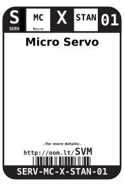
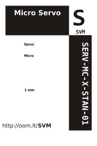

Contents
========

* [SERV-MC-X-STAN-01>Micro Servo](#serv-mc-x-stan-01micro-servo)
	* [Labels](#labels)
	* [EDA](#eda)
		* [Symbols](#symbols)
	* [Tags](#tags)

# SERV-MC-X-STAN-01>Micro Servo

- ID: SERV-MC-X-STAN-01
- Name: SERV-MC-X-STAN-01

## Labels
  
  

|label-front|label-inventory|label-spec|
| :---: | :---: | :---: |
||||

## EDA

### Symbols

## Tags

- oompType: SERV
- oompSize: MC
- oompColor: X
- oompDesc: STAN
- oompIndex: 01
- manufacturersPartNumber: TowerPro,TG9
- hexID: SVM
