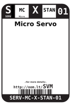
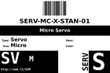

Contents
========

* [SVM > Micro Servo](#svm--micro-servo)
	* [Labels](#labels)
	* [EDA](#eda)
	* [Images](#images)
	* [Tags](#tags)

# SVM > Micro Servo

- ID: SERV-MC-X-STAN-01
- Hex ID: SVM
- Name: Micro Servo
- Description: Micro Servo
- Long Link: [http://oom.lt/SERV-MC-X-STAN-01](http://oom.lt/SERV-MC-X-STAN-01)
- Short Link: [http://oom.lt/SVM](http://oom.lt/SVM)

## Labels
  
  

|label-front|label-inventory|label-spec|
| :---: | :---: | :---: |
||||

## EDA

### Symbols

## Images
  
  

|label-front|label-inventory|label-spec|
| :---: | :---: | :---: |
||||

## Tags

- oompType: SERV
- oompSize: MC
- oompColor: X
- oompDesc: STAN
- oompIndex: 01
- manufacturersPartNumber: TowerPro,TG9
- hexID: SVM
- oompID: SERV-MC-X-STAN-01
