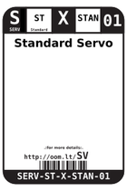
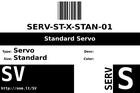
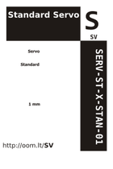

Contents
========

* [SV > Standard Servo](#sv--standard-servo)
	* [Labels](#labels)
	* [EDA](#eda)
	* [Images](#images)
	* [Tags](#tags)

# SV > Standard Servo

- ID: SERV-ST-X-STAN-01
- Hex ID: SV
- Name: Standard Servo
- Description: Standard Servo
- Long Link: [http://oom.lt/SERV-ST-X-STAN-01](http://oom.lt/SERV-ST-X-STAN-01)
- Short Link: [http://oom.lt/SV](http://oom.lt/SV)

## Labels
  
  

|label-front|label-inventory|label-spec|
| :---: | :---: | :---: |
||||

## EDA

## Images
  
  

|label-front|label-inventory|label-spec|
| :---: | :---: | :---: |
||||

## Tags

- oompType: SERV
- oompSize: ST
- oompColor: X
- oompDesc: STAN
- oompIndex: 01
- hexID: SV
- oompID: SERV-ST-X-STAN-01
