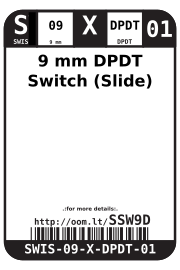
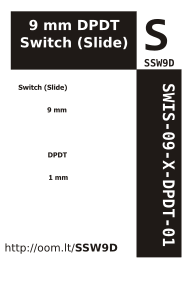

Contents
========

* [SWIS-09-X-DPDT-01>9 mm DPDT Switch (Slide)](#swis-09-x-dpdt-019-mm-dpdt-switch-slide)
	* [Images](#images)
	* [Datasheets](#datasheets)
	* [Labels](#labels)
	* [EDA](#eda)
		* [Symbols](#symbols)
	* [Tags](#tags)
  
![][im]
# SWIS-09-X-DPDT-01>9 mm DPDT Switch (Slide)

- ID: SWIS-09-X-DPDT-01
- Name: SWIS-09-X-DPDT-01

## Images
  
  

|image|image_BOTTOM|
| :---: | :---: |
|||

## Datasheets

- Datasheet: [datasheet.pdf](datasheet.pdf)

## Labels
  
  

|label-front|label-inventory|label-spec|
| :---: | :---: | :---: |
||||

## EDA

### Symbols

## Tags

- oompID: SWIS-09-X-DPDT-01
- name: 9 mm DPDT Switch (Slide)
- hexID: SSW9D
- oompSort: 
- oompClass: Through Hole
- oompClassCode: THTH
- oompType: SWIS
- oompSize: 09
- oompColor: X
- oompDesc: DPDT
- oompIndex: 01
- oompVersion: 40
- ooDesignator: S1

[im]: image_600.jpg
