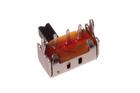
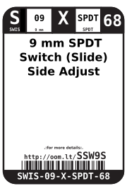
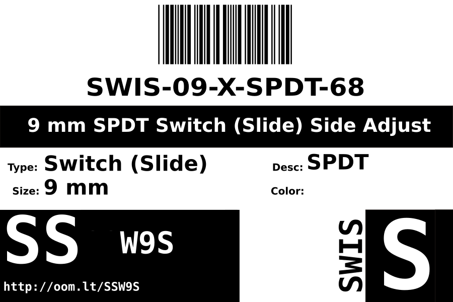
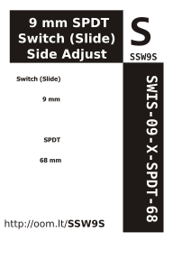

Contents
========

* [SWIS-09-X-SPDT-68> 9 mm SPDT Switch (Slide) Side Adjust ](#swis-09-x-spdt-68-9-mm-spdt-switch-slide-side-adjust-)
	* [Images](#images)
	* [Datasheets](#datasheets)
	* [Labels](#labels)
	* [EDA](#eda)
		* [Symbols](#symbols)
	* [Tags](#tags)
  
![][im]
# SWIS-09-X-SPDT-68> 9 mm SPDT Switch (Slide) Side Adjust 

- ID: SWIS-09-X-SPDT-68
- Name: SWIS-09-X-SPDT-68

## Images
  
  

|image|image_RE|image_BOTTOM|
| :---: | :---: | :---: |
||||

## Datasheets

- Datasheet: [datasheet.pdf](datasheet.pdf)

## Labels
  
  

|label-front|label-inventory|label-spec|
| :---: | :---: | :---: |
||||

## EDA

### Symbols

## Tags

- oompID: SWIS-09-X-SPDT-68
- name:  9 mm SPDT Switch (Slide) Side Adjust 
- hexID: SSW9S
- oompSort: SWIS09SPDT
- oompType: SWIS
- oompSize: 09
- oompColor: X
- oompDesc: SPDT
- oompIndex: 68
- oompVersion: 98
- ooNumPins: 3
- ooDesignator: S1

[im]: image_600.jpg
