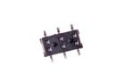
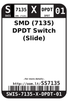

Contents
========

* [SS7135 > SMD (7135) DPDT Switch (Slide)](#ss7135--smd-7135-dpdt-switch-slide)
	* [Images](#images)
	* [Datasheets](#datasheets)
	* [Labels](#labels)
	* [EDA](#eda)
	* [Tags](#tags)
  
![][im]
# SS7135 > SMD (7135) DPDT Switch (Slide)

- ID: SWIS-7135-X-DPDT-01
- Hex ID: SS7135
- Name: SMD (7135) DPDT Switch (Slide)
- Description: SMD (7135) DPDT Switch (Slide)

## Images
  
  

|image|image_RE|image_BOTTOM|label-front|label-inventory|label-spec|
| :---: | :---: | :---: | :---: | :---: | :---: |
|||||||

## Datasheets

- Datasheet: [datasheet.pdf](datasheet.pdf)

## Labels
  
  

|label-front|label-inventory|label-spec|
| :---: | :---: | :---: |
||||

## EDA

### Symbols

## Tags

- oompID: SWIS-7135-X-DPDT-01
- name: SMD (7135) DPDT Switch (Slide)
- hexID: SS7135
- oompSort: SWIS7135DPDT
- oompType: SWIS
- oompSize: 7135
- oompColor: X
- oompDesc: DPDT
- oompIndex: 01
- oompVersion: 98
- ooNumPins: 6
- ooDesignator: S1

[im]: image_450.jpg
