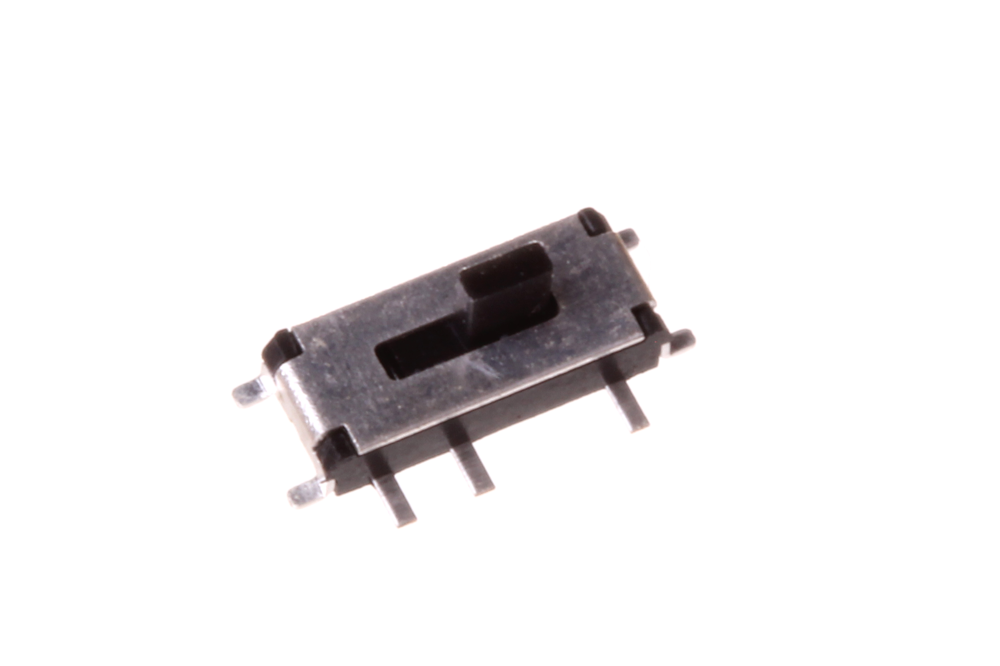
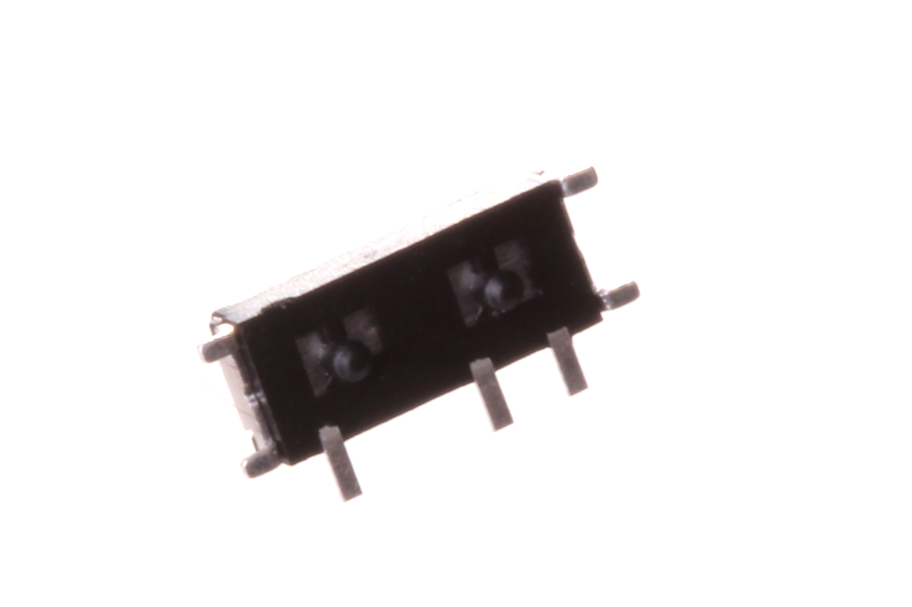
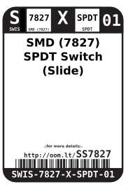
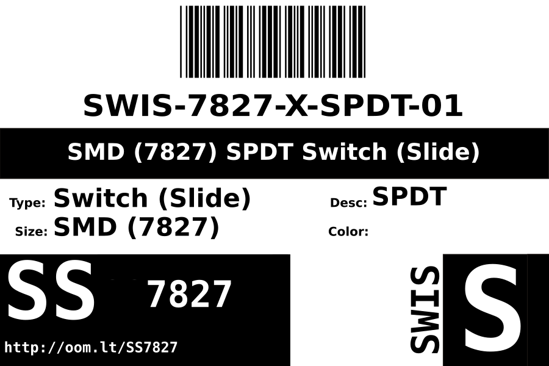
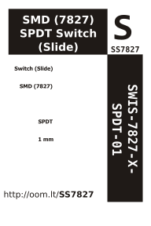

Contents
========

* [SWIS-7827-X-SPDT-01>SMD (7827) SPDT Switch (Slide)](#swis-7827-x-spdt-01smd-7827-spdt-switch-slide)
	* [Images](#images)
	* [Datasheets](#datasheets)
	* [Labels](#labels)
	* [EDA](#eda)
		* [Symbols](#symbols)
	* [Tags](#tags)
  
![][im]
# SWIS-7827-X-SPDT-01>SMD (7827) SPDT Switch (Slide)

- ID: SWIS-7827-X-SPDT-01
- Name: SWIS-7827-X-SPDT-01

## Images
  
  

|Main|Bottom|
| :---: | :---: |
|||

## Datasheets

- Datasheet: [datasheet.pdf](datasheet.pdf)

## Labels
  
  

|Front|Inventory|Specifications|
| :---: | :---: | :---: |
||||

## EDA

### Symbols

## Tags

- index: 778
- oompID: SWIS-7827-X-SPDT-01
- name: SMD (7827) SPDT Switch (Slide)
- hexID: SS7827
- oompSort: SWIS7827SPDT
- oompType: SWIS
- oompSize: 7827
- oompColor: X
- oompDesc: SPDT
- oompIndex: 01
- oompVersion: 98
- ooNumPins: 3
- ooDesignator: S1

[im]: image_600.jpg
