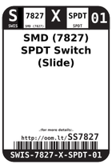

Contents
========

* [SS7827 > SMD (7827) SPDT Switch (Slide)](#ss7827--smd-7827-spdt-switch-slide)
	* [Datasheets](#datasheets)
	* [Labels](#labels)
	* [EDA](#eda)
	* [Images](#images)
	* [Tags](#tags)
  
![][im]
# SS7827 > SMD (7827) SPDT Switch (Slide)

- ID: SWIS-7827-X-SPDT-01
- Hex ID: SS7827
- Name: SMD (7827) SPDT Switch (Slide)
- Description: SMD (7827) SPDT Switch (Slide)
- Long Link: [http://oom.lt/SWIS-7827-X-SPDT-01](http://oom.lt/SWIS-7827-X-SPDT-01)
- Long Link: [http://oom.lt/SS7827](http://oom.lt/SS7827)

## Datasheets

- Datasheet: [datasheet.pdf](datasheet.pdf)

## Labels
  
  

|label-front|label-inventory|label-spec|
| :---: | :---: | :---: |
||||

## EDA

### Symbols

## Images
  
  

|image|image_BOTTOM|label-front|label-inventory|label-spec|
| :---: | :---: | :---: | :---: | :---: |
||||||

## Tags

- oompID: SWIS-7827-X-SPDT-01
- name: SMD (7827) SPDT Switch (Slide)
- hexID: SS7827
- oompSort: SWIS7827SPDT
- oompType: SWIS
- oompSize: 7827
- oompColor: X
- oompDesc: SPDT
- oompIndex: 01
- oompVersion: 98
- ooNumPins: 3
- ooDesignator: S1

[im]: image_450.jpg
