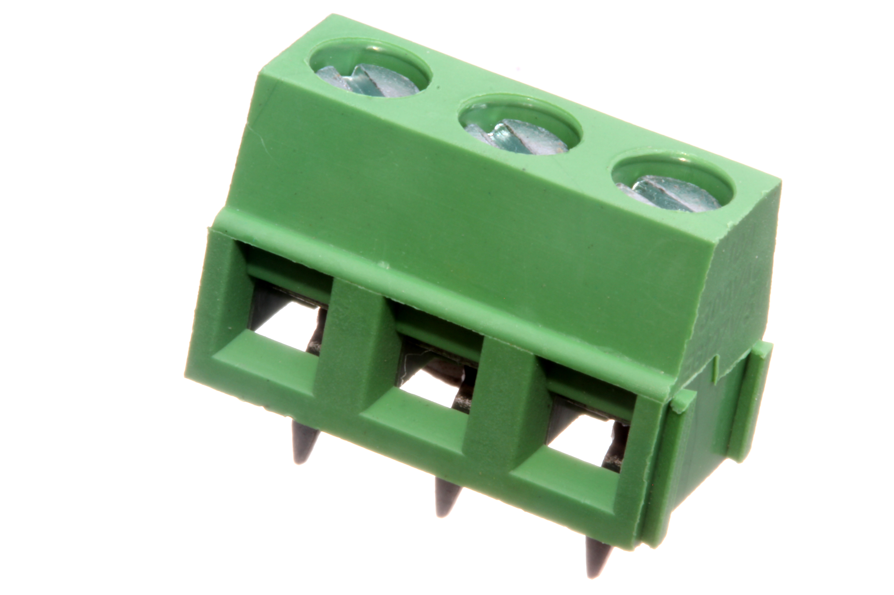
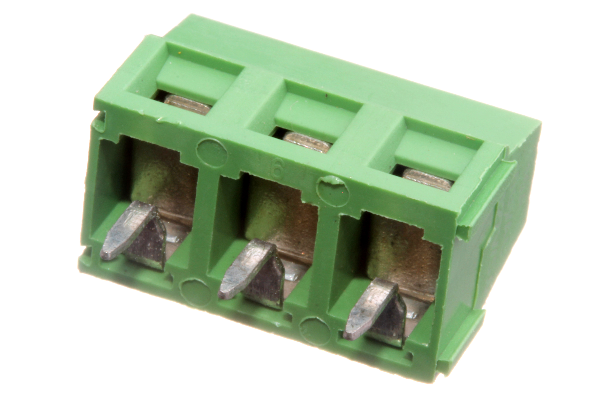
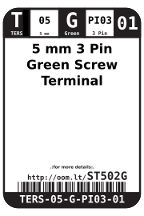
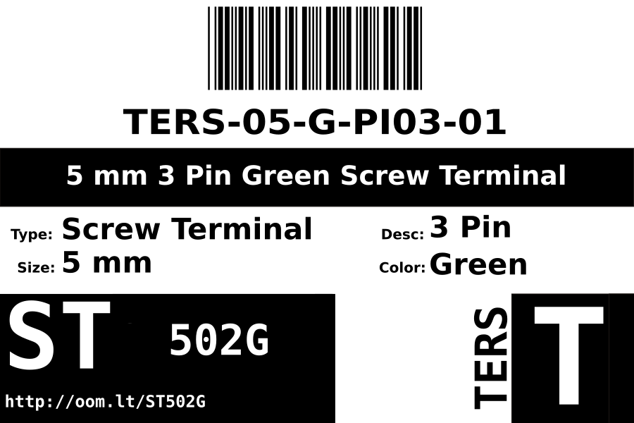
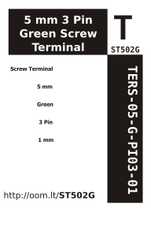

Contents
========

* [TERS-05-G-PI03-01>5 mm 3 Pin Green Screw Terminal](#ters-05-g-pi03-015-mm-3-pin-green-screw-terminal)
	* [Images](#images)
	* [Datasheets](#datasheets)
	* [Labels](#labels)
	* [EDA](#eda)
		* [Symbols](#symbols)
	* [Tags](#tags)
  
![][im]
# TERS-05-G-PI03-01>5 mm 3 Pin Green Screw Terminal

- ID: TERS-05-G-PI03-01
- Name: TERS-05-G-PI03-01

## Images
  
  

|Main|Bottom|
| :---: | :---: |
|||

## Datasheets

- Datasheet: [datasheet.pdf](datasheet.pdf)

## Labels
  
  

|Front|Inventory|Specifications|
| :---: | :---: | :---: |
||||

## EDA

### Symbols

## Tags

- index: 780
- oompID: TERS-05-G-PI03-01
- name: 5 mm 3 Pin Green Screw Terminal
- hexID: ST502G
- oompSort: 
- oompClass: Through Hole
- oompClassCode: THTH
- oompType: TERS
- oompSize: 05
- oompColor: G
- oompDesc: PI03
- oompIndex: 01
- oompVersion: 40
- ooNumPins: 3
- ooFootprint: OOMP-TERS-05-X-PI03-01
- ooDesignator: J1

[im]: image_600.jpg
