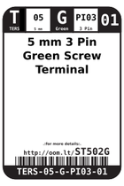
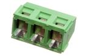

Contents
========

* [ST502G > 5 mm 3 Pin Green Screw Terminal](#st502g--5-mm-3-pin-green-screw-terminal)
	* [Datasheets](#datasheets)
	* [Labels](#labels)
	* [EDA](#eda)
	* [Images](#images)
	* [Tags](#tags)
  
![][im]
# ST502G > 5 mm 3 Pin Green Screw Terminal

- ID: TERS-05-G-PI03-01
- Hex ID: ST502G
- Name: 5 mm 3 Pin Green Screw Terminal
- Description: 5 mm 3 Pin Green Screw Terminal
- Long Link: [http://oom.lt/TERS-05-G-PI03-01](http://oom.lt/TERS-05-G-PI03-01)
- Long Link: [http://oom.lt/ST502G](http://oom.lt/ST502G)

## Datasheets

- Datasheet: [datasheet.pdf](datasheet.pdf)

## Labels
  
  

|label-front|label-inventory|label-spec|
| :---: | :---: | :---: |
||||

## EDA

### Symbols

## Images
  
  

|image|image_BOTTOM|label-front|label-inventory|label-spec|
| :---: | :---: | :---: | :---: | :---: |
||||||

## Tags

- oompID: TERS-05-G-PI03-01
- name: 5 mm 3 Pin Green Screw Terminal
- hexID: ST502G
- oompSort: 
- oompClass: Through Hole
- oompClassCode: THTH
- oompType: TERS
- oompSize: 05
- oompColor: G
- oompDesc: PI03
- oompIndex: 01
- oompVersion: 40
- ooNumPins: 3
- ooFootprint: OOMP-TERS-05-X-PI03-01
- ooDesignator: J1

[im]: image_450.jpg
