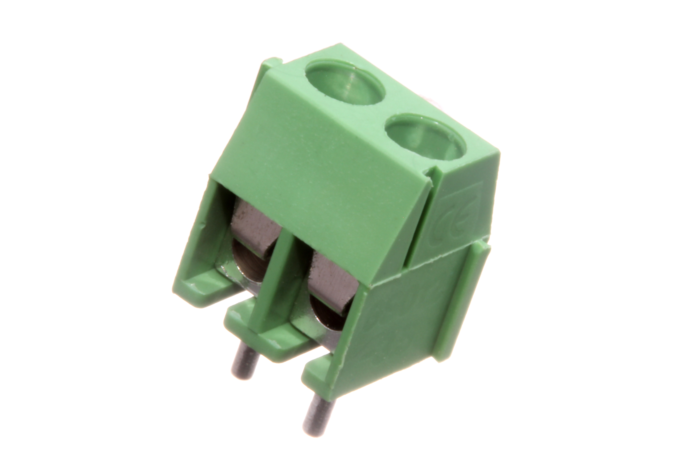
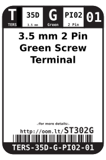
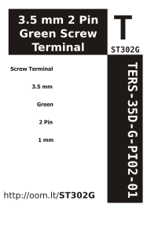

Contents
========

* [TERS-35D-G-PI02-01>3.5 mm 2 Pin Green Screw Terminal](#ters-35d-g-pi02-0135-mm-2-pin-green-screw-terminal)
	* [Images](#images)
	* [Datasheets](#datasheets)
	* [Labels](#labels)
	* [EDA](#eda)
		* [Symbols](#symbols)
	* [Tags](#tags)
  
![][im]
# TERS-35D-G-PI02-01>3.5 mm 2 Pin Green Screw Terminal

- ID: TERS-35D-G-PI02-01
- Name: TERS-35D-G-PI02-01

## Images
  
  

|Main|
| :---: |
||

## Datasheets

- Datasheet: [datasheet.pdf](datasheet.pdf)

## Labels
  
  

|Front|Inventory|Specifications|
| :---: | :---: | :---: |
||||

## EDA

### Symbols

## Tags

- oompID: TERS-35D-G-PI02-01
- name: 3.5 mm 2 Pin Green Screw Terminal
- hexID: ST302G
- oompSort: 
- oompClass: Through Hole
- oompClassCode: THTH
- oompType: TERS
- oompSize: 35D
- oompColor: G
- oompDesc: PI02
- oompIndex: 01
- oompVersion: 40
- ooDesignator: J1

[im]: image_600.jpg
