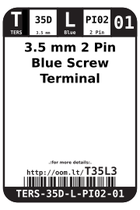
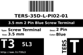
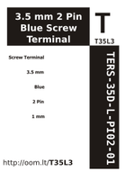

Contents
========

* [T35L2 > 3.5 mm 2 Pin Blue Screw Terminal](#t35l2--35-mm-2-pin-blue-screw-terminal)
	* [Datasheets](#datasheets)
	* [Labels](#labels)
	* [EDA](#eda)
	* [Images](#images)
	* [Tags](#tags)

# T35L2 > 3.5 mm 2 Pin Blue Screw Terminal

- ID: TERS-35D-L-PI02-01
- Hex ID: T35L2
- Name: 3.5 mm 2 Pin Blue Screw Terminal
- Description: 3.5 mm 2 Pin Blue Screw Terminal
- Long Link: [http://oom.lt/TERS-35D-L-PI02-01](http://oom.lt/TERS-35D-L-PI02-01)
- Short Link: [http://oom.lt/T35L2](http://oom.lt/T35L2)

## Datasheets

- Datasheet: [datasheet.pdf](datasheet.pdf)

## Labels
  
  

|label-front|label-inventory|label-spec|
| :---: | :---: | :---: |
||||

## EDA

### Footprints
  

|[  FOOTPRINT-kicad-kicad-footprints-TerminalBlock_4Ucon-TerminalBlock_4Ucon_1x02_P3.50mm_Vertical](https://github.com/oomlout/oomlout_OOMP_eda/tree/main/FOOTPRINT/kicad/kicad-footprints/TerminalBlock_4Ucon/TerminalBlock_4Ucon_1x02_P3.50mm_Vertical/)||||
| :---: | :---: | :---: | :---: |

### Symbols
  

|[  SYMBOL-kicad-kicad-symbols-Connector-Screw_Terminal_01x02](https://github.com/oomlout/oomlout_OOMP_eda/tree/main/SYMBOL/kicad/kicad-symbols/Connector/Screw_Terminal_01x02/)||||
| :---: | :---: | :---: | :---: |
  

### Instances
  
Used 119 times.  
Prevalance: (119\10986) 1.0832%  

|Project|Occur- rences|Identifiers|
| :---: | :---: | :---: |
|[PROJ-ADAF-1164-STAN-01 Adafruit INA169 Breakout PCB](https://github.com/oomlout/oomlout_OOMP_projects/tree/main/PROJ-ADAF-1164-STAN-01/)|[1](https://github.com/oomlout/oomlout_OOMP_projects/tree/main/PROJ-ADAF-1164-STAN-01/)|[J1](https://github.com/oomlout/oomlout_OOMP_projects/tree/main/PROJ-ADAF-1164-STAN-01/)|
|[PROJ-ADAF-1411-STAN-01 Adafruit 16 channel PWM Servo Shield](https://github.com/oomlout/oomlout_OOMP_projects/tree/main/PROJ-ADAF-1411-STAN-01/)|[1](https://github.com/oomlout/oomlout_OOMP_projects/tree/main/PROJ-ADAF-1411-STAN-01/)|[J1](https://github.com/oomlout/oomlout_OOMP_projects/tree/main/PROJ-ADAF-1411-STAN-01/)|
|[PROJ-ADAF-1429-STAN-01 Adafruit TLC5947 PCB](https://github.com/oomlout/oomlout_OOMP_projects/tree/main/PROJ-ADAF-1429-STAN-01/)|[1](https://github.com/oomlout/oomlout_OOMP_projects/tree/main/PROJ-ADAF-1429-STAN-01/)|[J1](https://github.com/oomlout/oomlout_OOMP_projects/tree/main/PROJ-ADAF-1429-STAN-01/)|
|[PROJ-ADAF-1430-STAN-01 Adafruit NeoPixel Shield PCB](https://github.com/oomlout/oomlout_OOMP_projects/tree/main/PROJ-ADAF-1430-STAN-01/)|[1](https://github.com/oomlout/oomlout_OOMP_projects/tree/main/PROJ-ADAF-1430-STAN-01/)|[J1](https://github.com/oomlout/oomlout_OOMP_projects/tree/main/PROJ-ADAF-1430-STAN-01/)|
|[PROJ-ADAF-1438-STAN-01 Adafruit Motor Shield V2 PCB](https://github.com/oomlout/oomlout_OOMP_projects/tree/main/PROJ-ADAF-1438-STAN-01/)|[2](https://github.com/oomlout/oomlout_OOMP_projects/tree/main/PROJ-ADAF-1438-STAN-01/)|[MPOWER, SERPWR](https://github.com/oomlout/oomlout_OOMP_projects/tree/main/PROJ-ADAF-1438-STAN-01/)|
|[PROJ-ADAF-1552-STAN-01 Adafruit TPA2012 or TS2012 Breakout PCB](https://github.com/oomlout/oomlout_OOMP_projects/tree/main/PROJ-ADAF-1552-STAN-01/)|[2](https://github.com/oomlout/oomlout_OOMP_projects/tree/main/PROJ-ADAF-1552-STAN-01/)|[J1, J2](https://github.com/oomlout/oomlout_OOMP_projects/tree/main/PROJ-ADAF-1552-STAN-01/)|
|[PROJ-ADAF-1712-STAN-01 Adafruit TPA2016 PCB](https://github.com/oomlout/oomlout_OOMP_projects/tree/main/PROJ-ADAF-1712-STAN-01/)|[2](https://github.com/oomlout/oomlout_OOMP_projects/tree/main/PROJ-ADAF-1712-STAN-01/)|[J1, J2](https://github.com/oomlout/oomlout_OOMP_projects/tree/main/PROJ-ADAF-1712-STAN-01/)|
|[PROJ-ADAF-1727-STAN-01 Adafruit MAX31850 thermocouple breakout board](https://github.com/oomlout/oomlout_OOMP_projects/tree/main/PROJ-ADAF-1727-STAN-01/)|[1](https://github.com/oomlout/oomlout_OOMP_projects/tree/main/PROJ-ADAF-1727-STAN-01/)|[X1](https://github.com/oomlout/oomlout_OOMP_projects/tree/main/PROJ-ADAF-1727-STAN-01/)|
|[PROJ-ADAF-1752-STAN-01 Adafruit MAX9744 Amplifier PCB](https://github.com/oomlout/oomlout_OOMP_projects/tree/main/PROJ-ADAF-1752-STAN-01/)|[3](https://github.com/oomlout/oomlout_OOMP_projects/tree/main/PROJ-ADAF-1752-STAN-01/)|[J1, J2, J3](https://github.com/oomlout/oomlout_OOMP_projects/tree/main/PROJ-ADAF-1752-STAN-01/)|
|[PROJ-ADAF-1778-STAN-01 Adafruit AD8495 Breakout PCB](https://github.com/oomlout/oomlout_OOMP_projects/tree/main/PROJ-ADAF-1778-STAN-01/)|[1](https://github.com/oomlout/oomlout_OOMP_projects/tree/main/PROJ-ADAF-1778-STAN-01/)|[X1](https://github.com/oomlout/oomlout_OOMP_projects/tree/main/PROJ-ADAF-1778-STAN-01/)|
|[PROJ-ADAF-1788-STAN-01 Adafruit Music Maker MP3 Shield PCB](https://github.com/oomlout/oomlout_OOMP_projects/tree/main/PROJ-ADAF-1788-STAN-01/)|[2](https://github.com/oomlout/oomlout_OOMP_projects/tree/main/PROJ-ADAF-1788-STAN-01/)|[LEFTSPK, RIGHTSPK](https://github.com/oomlout/oomlout_OOMP_projects/tree/main/PROJ-ADAF-1788-STAN-01/)|
|[PROJ-ADAF-1903-STAN-01 Adafruit PowerBoost 500 Basic PCB](https://github.com/oomlout/oomlout_OOMP_projects/tree/main/PROJ-ADAF-1903-STAN-01/)|[1](https://github.com/oomlout/oomlout_OOMP_projects/tree/main/PROJ-ADAF-1903-STAN-01/)|[X1](https://github.com/oomlout/oomlout_OOMP_projects/tree/main/PROJ-ADAF-1903-STAN-01/)|
|[PROJ-ADAF-1944-STAN-01 Adafruit PowerBoost 500 Charger PCB](https://github.com/oomlout/oomlout_OOMP_projects/tree/main/PROJ-ADAF-1944-STAN-01/)|[1](https://github.com/oomlout/oomlout_OOMP_projects/tree/main/PROJ-ADAF-1944-STAN-01/)|[X1](https://github.com/oomlout/oomlout_OOMP_projects/tree/main/PROJ-ADAF-1944-STAN-01/)|
|[PROJ-ADAF-196-STAN-01 Adafruit Proto Screwshield PCB](https://github.com/oomlout/oomlout_OOMP_projects/tree/main/PROJ-ADAF-196-STAN-01/)|[1](https://github.com/oomlout/oomlout_OOMP_projects/tree/main/PROJ-ADAF-196-STAN-01/)|[J1](https://github.com/oomlout/oomlout_OOMP_projects/tree/main/PROJ-ADAF-196-STAN-01/)|
|[PROJ-ADAF-2030-STAN-01 Adafruit PowerBoost 1000 PCB](https://github.com/oomlout/oomlout_OOMP_projects/tree/main/PROJ-ADAF-2030-STAN-01/)|[2](https://github.com/oomlout/oomlout_OOMP_projects/tree/main/PROJ-ADAF-2030-STAN-01/)|[X1, X2](https://github.com/oomlout/oomlout_OOMP_projects/tree/main/PROJ-ADAF-2030-STAN-01/)|
|[PROJ-ADAF-2130-STAN-01 Adafruit PAM8302 Mono Amplifier PCB](https://github.com/oomlout/oomlout_OOMP_projects/tree/main/PROJ-ADAF-2130-STAN-01/)|[1](https://github.com/oomlout/oomlout_OOMP_projects/tree/main/PROJ-ADAF-2130-STAN-01/)|[X1](https://github.com/oomlout/oomlout_OOMP_projects/tree/main/PROJ-ADAF-2130-STAN-01/)|
|[PROJ-ADAF-2190-STAN-01 Adafruit Verter PCB](https://github.com/oomlout/oomlout_OOMP_projects/tree/main/PROJ-ADAF-2190-STAN-01/)|[2](https://github.com/oomlout/oomlout_OOMP_projects/tree/main/PROJ-ADAF-2190-STAN-01/)|[X1, X2](https://github.com/oomlout/oomlout_OOMP_projects/tree/main/PROJ-ADAF-2190-STAN-01/)|
|[PROJ-ADAF-2200-STAN-01 Adafruit LM4040 Voltage Reference PCB](https://github.com/oomlout/oomlout_OOMP_projects/tree/main/PROJ-ADAF-2200-STAN-01/)|[2](https://github.com/oomlout/oomlout_OOMP_projects/tree/main/PROJ-ADAF-2200-STAN-01/)|[X1, X2](https://github.com/oomlout/oomlout_OOMP_projects/tree/main/PROJ-ADAF-2200-STAN-01/)|
|[PROJ-ADAF-2348-STAN-01 Adafruit DC Stepper Motor HAT PCB](https://github.com/oomlout/oomlout_OOMP_projects/tree/main/PROJ-ADAF-2348-STAN-01/)|[1](https://github.com/oomlout/oomlout_OOMP_projects/tree/main/PROJ-ADAF-2348-STAN-01/)|[MPOWER](https://github.com/oomlout/oomlout_OOMP_projects/tree/main/PROJ-ADAF-2348-STAN-01/)|
|[PROJ-ADAF-2448-STAN-01 Adafruit TB6612 Motor Driver Breakout PCB](https://github.com/oomlout/oomlout_OOMP_projects/tree/main/PROJ-ADAF-2448-STAN-01/)|[1](https://github.com/oomlout/oomlout_OOMP_projects/tree/main/PROJ-ADAF-2448-STAN-01/)|[J1](https://github.com/oomlout/oomlout_OOMP_projects/tree/main/PROJ-ADAF-2448-STAN-01/)|
|[PROJ-ADAF-2465-STAN-01 Adafruit PowerBoost 1000C](https://github.com/oomlout/oomlout_OOMP_projects/tree/main/PROJ-ADAF-2465-STAN-01/)|[1](https://github.com/oomlout/oomlout_OOMP_projects/tree/main/PROJ-ADAF-2465-STAN-01/)|[X1](https://github.com/oomlout/oomlout_OOMP_projects/tree/main/PROJ-ADAF-2465-STAN-01/)|
|[PROJ-ADAF-269-STAN-01 Adafruit MAX31855 breakout board](https://github.com/oomlout/oomlout_OOMP_projects/tree/main/PROJ-ADAF-269-STAN-01/)|[1](https://github.com/oomlout/oomlout_OOMP_projects/tree/main/PROJ-ADAF-269-STAN-01/)|[J1](https://github.com/oomlout/oomlout_OOMP_projects/tree/main/PROJ-ADAF-269-STAN-01/)|
|[PROJ-ADAF-2926-STAN-01 Adafruit Terminal Block FeatherWing PCB](https://github.com/oomlout/oomlout_OOMP_projects/tree/main/PROJ-ADAF-2926-STAN-01/)|[4](https://github.com/oomlout/oomlout_OOMP_projects/tree/main/PROJ-ADAF-2926-STAN-01/)|[X1, X2, X3, X4](https://github.com/oomlout/oomlout_OOMP_projects/tree/main/PROJ-ADAF-2926-STAN-01/)|
|[PROJ-ADAF-2927-STAN-01 Adafruit DC Stepper Motor FeatherWing PCB](https://github.com/oomlout/oomlout_OOMP_projects/tree/main/PROJ-ADAF-2927-STAN-01/)|[5](https://github.com/oomlout/oomlout_OOMP_projects/tree/main/PROJ-ADAF-2927-STAN-01/)|[MPOWER, X1, X2, X4, X6](https://github.com/oomlout/oomlout_OOMP_projects/tree/main/PROJ-ADAF-2927-STAN-01/)|
|[PROJ-ADAF-2928-STAN-01 Adafruit PWM Servo FeatherWing PCB](https://github.com/oomlout/oomlout_OOMP_projects/tree/main/PROJ-ADAF-2928-STAN-01/)|[1](https://github.com/oomlout/oomlout_OOMP_projects/tree/main/PROJ-ADAF-2928-STAN-01/)|[J1](https://github.com/oomlout/oomlout_OOMP_projects/tree/main/PROJ-ADAF-2928-STAN-01/)|
|[PROJ-ADAF-3006-STAN-01 Adafruit MAX98357 I2S Amp Breakout](https://github.com/oomlout/oomlout_OOMP_projects/tree/main/PROJ-ADAF-3006-STAN-01/)|[1](https://github.com/oomlout/oomlout_OOMP_projects/tree/main/PROJ-ADAF-3006-STAN-01/)|[X1](https://github.com/oomlout/oomlout_OOMP_projects/tree/main/PROJ-ADAF-3006-STAN-01/)|
|[PROJ-ADAF-3190-STAN-01 Adafruit DRV8871 Breakout PCB](https://github.com/oomlout/oomlout_OOMP_projects/tree/main/PROJ-ADAF-3190-STAN-01/)|[2](https://github.com/oomlout/oomlout_OOMP_projects/tree/main/PROJ-ADAF-3190-STAN-01/)|[X1, X2](https://github.com/oomlout/oomlout_OOMP_projects/tree/main/PROJ-ADAF-3190-STAN-01/)|
|[PROJ-ADAF-3263-STAN-01 Adafruit MAX31856 PCB](https://github.com/oomlout/oomlout_OOMP_projects/tree/main/PROJ-ADAF-3263-STAN-01/)|[1](https://github.com/oomlout/oomlout_OOMP_projects/tree/main/PROJ-ADAF-3263-STAN-01/)|[X1](https://github.com/oomlout/oomlout_OOMP_projects/tree/main/PROJ-ADAF-3263-STAN-01/)|
|[PROJ-ADAF-3297-STAN-01 Adafruit DRV8833 Motor Driver Breakout PCB](https://github.com/oomlout/oomlout_OOMP_projects/tree/main/PROJ-ADAF-3297-STAN-01/)|[1](https://github.com/oomlout/oomlout_OOMP_projects/tree/main/PROJ-ADAF-3297-STAN-01/)|[J1](https://github.com/oomlout/oomlout_OOMP_projects/tree/main/PROJ-ADAF-3297-STAN-01/)|
|[PROJ-ADAF-3328-STAN-01 Adafruit MAX31865 PCB](https://github.com/oomlout/oomlout_OOMP_projects/tree/main/PROJ-ADAF-3328-STAN-01/)|[2](https://github.com/oomlout/oomlout_OOMP_projects/tree/main/PROJ-ADAF-3328-STAN-01/)|[X1, X2](https://github.com/oomlout/oomlout_OOMP_projects/tree/main/PROJ-ADAF-3328-STAN-01/)|
|[PROJ-ADAF-3346-STAN-01 Adafruit Stereo Speaker Bonnet PCB](https://github.com/oomlout/oomlout_OOMP_projects/tree/main/PROJ-ADAF-3346-STAN-01/)|[2](https://github.com/oomlout/oomlout_OOMP_projects/tree/main/PROJ-ADAF-3346-STAN-01/)|[X1, X2](https://github.com/oomlout/oomlout_OOMP_projects/tree/main/PROJ-ADAF-3346-STAN-01/)|
|[PROJ-ADAF-3422-STAN-01 Adafruit Arcade Bonnet PCB](https://github.com/oomlout/oomlout_OOMP_projects/tree/main/PROJ-ADAF-3422-STAN-01/)|[1](https://github.com/oomlout/oomlout_OOMP_projects/tree/main/PROJ-ADAF-3422-STAN-01/)|[SPKR](https://github.com/oomlout/oomlout_OOMP_projects/tree/main/PROJ-ADAF-3422-STAN-01/)|
|[PROJ-ADAF-4538-STAN-01 Adafruit NAU7802 PCB](https://github.com/oomlout/oomlout_OOMP_projects/tree/main/PROJ-ADAF-4538-STAN-01/)|[2](https://github.com/oomlout/oomlout_OOMP_projects/tree/main/PROJ-ADAF-4538-STAN-01/)|[X1, X2](https://github.com/oomlout/oomlout_OOMP_projects/tree/main/PROJ-ADAF-4538-STAN-01/)|
|[PROJ-ADAF-5165-STAN-01 Adafruit MCP9601 PCB](https://github.com/oomlout/oomlout_OOMP_projects/tree/main/PROJ-ADAF-5165-STAN-01/)|[1](https://github.com/oomlout/oomlout_OOMP_projects/tree/main/PROJ-ADAF-5165-STAN-01/)|[X1](https://github.com/oomlout/oomlout_OOMP_projects/tree/main/PROJ-ADAF-5165-STAN-01/)|
|[PROJ-ADAF-801-STAN-01 Adafruit Prototyping Pi Plate PCB](https://github.com/oomlout/oomlout_OOMP_projects/tree/main/PROJ-ADAF-801-STAN-01/)|[2](https://github.com/oomlout/oomlout_OOMP_projects/tree/main/PROJ-ADAF-801-STAN-01/)|[J1, J2](https://github.com/oomlout/oomlout_OOMP_projects/tree/main/PROJ-ADAF-801-STAN-01/)|
|[PROJ-ADAF-815-STAN-01 Adafruit 16 Channel PWM Servo Driver PCB](https://github.com/oomlout/oomlout_OOMP_projects/tree/main/PROJ-ADAF-815-STAN-01/)|[1](https://github.com/oomlout/oomlout_OOMP_projects/tree/main/PROJ-ADAF-815-STAN-01/)|[J1](https://github.com/oomlout/oomlout_OOMP_projects/tree/main/PROJ-ADAF-815-STAN-01/)|
|[PROJ-ADAF-904-STAN-01 Adafruit INA219 Current Sensor PCB](https://github.com/oomlout/oomlout_OOMP_projects/tree/main/PROJ-ADAF-904-STAN-01/)|[1](https://github.com/oomlout/oomlout_OOMP_projects/tree/main/PROJ-ADAF-904-STAN-01/)|[J1](https://github.com/oomlout/oomlout_OOMP_projects/tree/main/PROJ-ADAF-904-STAN-01/)|
|[PROJ-ADAF-935-STAN-01 Adafruit MCP4725 PCB](https://github.com/oomlout/oomlout_OOMP_projects/tree/main/PROJ-ADAF-935-STAN-01/)|[1](https://github.com/oomlout/oomlout_OOMP_projects/tree/main/PROJ-ADAF-935-STAN-01/)|[X1](https://github.com/oomlout/oomlout_OOMP_projects/tree/main/PROJ-ADAF-935-STAN-01/)|
|[PROJ-ADAF-987-STAN-01 Adafruit MAX98306 Class D Amp PCB](https://github.com/oomlout/oomlout_OOMP_projects/tree/main/PROJ-ADAF-987-STAN-01/)|[2](https://github.com/oomlout/oomlout_OOMP_projects/tree/main/PROJ-ADAF-987-STAN-01/)|[J1, J2](https://github.com/oomlout/oomlout_OOMP_projects/tree/main/PROJ-ADAF-987-STAN-01/)|
|[PROJ-SPAR-10507-STAN-01 Quadstepper Motor Driver](https://github.com/oomlout/oomlout_OOMP_projects/tree/main/PROJ-SPAR-10507-STAN-01/)|[8](https://github.com/oomlout/oomlout_OOMP_projects/tree/main/PROJ-SPAR-10507-STAN-01/)|[JP1, JP2, JP5, JP6, JP7, JP8, JP14, JP15](https://github.com/oomlout/oomlout_OOMP_projects/tree/main/PROJ-SPAR-10507-STAN-01/)|
|[PROJ-SPAR-10615-STAN-01 PWM Shield](https://github.com/oomlout/oomlout_OOMP_projects/tree/main/PROJ-SPAR-10615-STAN-01/)|[1](https://github.com/oomlout/oomlout_OOMP_projects/tree/main/PROJ-SPAR-10615-STAN-01/)|[JP19](https://github.com/oomlout/oomlout_OOMP_projects/tree/main/PROJ-SPAR-10615-STAN-01/)|
|[PROJ-SPAR-10618-STAN-01 Power Driver Shield Kit](https://github.com/oomlout/oomlout_OOMP_projects/tree/main/PROJ-SPAR-10618-STAN-01/)|[6](https://github.com/oomlout/oomlout_OOMP_projects/tree/main/PROJ-SPAR-10618-STAN-01/)|[JP6, JP9, JP10, JP11, JP12, JP13](https://github.com/oomlout/oomlout_OOMP_projects/tree/main/PROJ-SPAR-10618-STAN-01/)|
|[PROJ-SPAR-11197-STAN-01 ATmega128RFA1 Dev](https://github.com/oomlout/oomlout_OOMP_projects/tree/main/PROJ-SPAR-11197-STAN-01/)|[1](https://github.com/oomlout/oomlout_OOMP_projects/tree/main/PROJ-SPAR-11197-STAN-01/)|[JP8](https://github.com/oomlout/oomlout_OOMP_projects/tree/main/PROJ-SPAR-11197-STAN-01/)|
|[PROJ-SPAR-11561-STAN-01 RaspiRobot](https://github.com/oomlout/oomlout_OOMP_projects/tree/main/PROJ-SPAR-11561-STAN-01/)|[2](https://github.com/oomlout/oomlout_OOMP_projects/tree/main/PROJ-SPAR-11561-STAN-01/)|[JP1, JP2](https://github.com/oomlout/oomlout_OOMP_projects/tree/main/PROJ-SPAR-11561-STAN-01/)|
|[PROJ-SPAR-11850-STAN-01 PicoBuck](https://github.com/oomlout/oomlout_OOMP_projects/tree/main/PROJ-SPAR-11850-STAN-01/)|[4](https://github.com/oomlout/oomlout_OOMP_projects/tree/main/PROJ-SPAR-11850-STAN-01/)|[CH1, CH2, CH3, JP2](https://github.com/oomlout/oomlout_OOMP_projects/tree/main/PROJ-SPAR-11850-STAN-01/)|
|[PROJ-SPAR-11890-STAN-01 MiniMoto](https://github.com/oomlout/oomlout_OOMP_projects/tree/main/PROJ-SPAR-11890-STAN-01/)|[3](https://github.com/oomlout/oomlout_OOMP_projects/tree/main/PROJ-SPAR-11890-STAN-01/)|[J2, J4, J6](https://github.com/oomlout/oomlout_OOMP_projects/tree/main/PROJ-SPAR-11890-STAN-01/)|
|[PROJ-SPAR-12859-STAN-01 Big Easy Driver](https://github.com/oomlout/oomlout_OOMP_projects/tree/main/PROJ-SPAR-12859-STAN-01/)|[2](https://github.com/oomlout/oomlout_OOMP_projects/tree/main/PROJ-SPAR-12859-STAN-01/)|[JP7, JP13](https://github.com/oomlout/oomlout_OOMP_projects/tree/main/PROJ-SPAR-12859-STAN-01/)|
|[PROJ-SPAR-12885-STAN-01 SunnyBuddy](https://github.com/oomlout/oomlout_OOMP_projects/tree/main/PROJ-SPAR-12885-STAN-01/)|[3](https://github.com/oomlout/oomlout_OOMP_projects/tree/main/PROJ-SPAR-12885-STAN-01/)|[J6, J7, J8](https://github.com/oomlout/oomlout_OOMP_projects/tree/main/PROJ-SPAR-12885-STAN-01/)|
|[PROJ-SPAR-12959-STAN-01 MOSFET Power Control Kit](https://github.com/oomlout/oomlout_OOMP_projects/tree/main/PROJ-SPAR-12959-STAN-01/)|[1](https://github.com/oomlout/oomlout_OOMP_projects/tree/main/PROJ-SPAR-12959-STAN-01/)|[JP1](https://github.com/oomlout/oomlout_OOMP_projects/tree/main/PROJ-SPAR-12959-STAN-01/)|
|[PROJ-SPAR-13155-STAN-01 SparkFun Stepoko](https://github.com/oomlout/oomlout_OOMP_projects/tree/main/PROJ-SPAR-13155-STAN-01/)|[13](https://github.com/oomlout/oomlout_OOMP_projects/tree/main/PROJ-SPAR-13155-STAN-01/)|[JP1, JP3, JP4, JP8, JP9, JP15, VIN, X-A, X-B, Y-A, Y-B, Z-A, Z-B](https://github.com/oomlout/oomlout_OOMP_projects/tree/main/PROJ-SPAR-13155-STAN-01/)|
|[PROJ-SPAR-13630-STAN-01 Photon Weather Shield](https://github.com/oomlout/oomlout_OOMP_projects/tree/main/PROJ-SPAR-13630-STAN-01/)|[1](https://github.com/oomlout/oomlout_OOMP_projects/tree/main/PROJ-SPAR-13630-STAN-01/)|[JP6-DNP](https://github.com/oomlout/oomlout_OOMP_projects/tree/main/PROJ-SPAR-13630-STAN-01/)|
|[PROJ-SPAR-13711-STAN-01 ESP8266 Thing Dev 4H](https://github.com/oomlout/oomlout_OOMP_projects/tree/main/PROJ-SPAR-13711-STAN-01/)|[1](https://github.com/oomlout/oomlout_OOMP_projects/tree/main/PROJ-SPAR-13711-STAN-01/)|[JP6](https://github.com/oomlout/oomlout_OOMP_projects/tree/main/PROJ-SPAR-13711-STAN-01/)|
|[PROJ-SPAR-13716-STAN-01 FemtoBuck](https://github.com/oomlout/oomlout_OOMP_projects/tree/main/PROJ-SPAR-13716-STAN-01/)|[1](https://github.com/oomlout/oomlout_OOMP_projects/tree/main/PROJ-SPAR-13716-STAN-01/)|[CH1](https://github.com/oomlout/oomlout_OOMP_projects/tree/main/PROJ-SPAR-13716-STAN-01/)|
|[PROJ-SPAR-13752-STAN-01 L6470-AutoDriver](https://github.com/oomlout/oomlout_OOMP_projects/tree/main/PROJ-SPAR-13752-STAN-01/)|[5](https://github.com/oomlout/oomlout_OOMP_projects/tree/main/PROJ-SPAR-13752-STAN-01/)|[JP5, JP6, JP7, JP8, JP9](https://github.com/oomlout/oomlout_OOMP_projects/tree/main/PROJ-SPAR-13752-STAN-01/)|
|[PROJ-SPAR-13777-STAN-01 Battery Babysitter](https://github.com/oomlout/oomlout_OOMP_projects/tree/main/PROJ-SPAR-13777-STAN-01/)|[2](https://github.com/oomlout/oomlout_OOMP_projects/tree/main/PROJ-SPAR-13777-STAN-01/)|[JP3, JP7](https://github.com/oomlout/oomlout_OOMP_projects/tree/main/PROJ-SPAR-13777-STAN-01/)|
|[PROJ-SPAR-14066-STAN-01 Simultaneous RFID Tag Reader](https://github.com/oomlout/oomlout_OOMP_projects/tree/main/PROJ-SPAR-14066-STAN-01/)|[1](https://github.com/oomlout/oomlout_OOMP_projects/tree/main/PROJ-SPAR-14066-STAN-01/)|[J6](https://github.com/oomlout/oomlout_OOMP_projects/tree/main/PROJ-SPAR-14066-STAN-01/)|
|[PROJ-SPAR-14129-STAN-01 Ardumoto-Motor Driver Shield](https://github.com/oomlout/oomlout_OOMP_projects/tree/main/PROJ-SPAR-14129-STAN-01/)|[1](https://github.com/oomlout/oomlout_OOMP_projects/tree/main/PROJ-SPAR-14129-STAN-01/)|[J10](https://github.com/oomlout/oomlout_OOMP_projects/tree/main/PROJ-SPAR-14129-STAN-01/)|
|[PROJ-SPAR-14449-STAN-01 Variable Load](https://github.com/oomlout/oomlout_OOMP_projects/tree/main/PROJ-SPAR-14449-STAN-01/)|[1](https://github.com/oomlout/oomlout_OOMP_projects/tree/main/PROJ-SPAR-14449-STAN-01/)|[J4](https://github.com/oomlout/oomlout_OOMP_projects/tree/main/PROJ-SPAR-14449-STAN-01/)|
|[PROJ-SPAR-14809-STAN-01 I2S Audio Breakout](https://github.com/oomlout/oomlout_OOMP_projects/tree/main/PROJ-SPAR-14809-STAN-01/)|[1](https://github.com/oomlout/oomlout_OOMP_projects/tree/main/PROJ-SPAR-14809-STAN-01/)|[J1](https://github.com/oomlout/oomlout_OOMP_projects/tree/main/PROJ-SPAR-14809-STAN-01/)|

## Images
  
  

|label-front|label-inventory|label-spec|
| :---: | :---: | :---: |
||||

## Tags

- oompType: TERS
- oompSize: 35D
- oompColor: L
- oompDesc: PI02
- oompIndex: 01
- hexID: T35L2
- oompID: TERS-35D-L-PI02-01
- oompInstances: {'PROJECT': 'PROJ-ADAF-1164-STAN-01', 'ID': 'J1'}
- oompInstances: {'PROJECT': 'PROJ-ADAF-1411-STAN-01', 'ID': 'J1'}
- oompInstances: {'PROJECT': 'PROJ-ADAF-1429-STAN-01', 'ID': 'J1'}
- oompInstances: {'PROJECT': 'PROJ-ADAF-1430-STAN-01', 'ID': 'J1'}
- oompInstances: {'PROJECT': 'PROJ-ADAF-1438-STAN-01', 'ID': 'MPOWER'}
- oompInstances: {'PROJECT': 'PROJ-ADAF-1438-STAN-01', 'ID': 'SERPWR'}
- oompInstances: {'PROJECT': 'PROJ-ADAF-1552-STAN-01', 'ID': 'J1'}
- oompInstances: {'PROJECT': 'PROJ-ADAF-1552-STAN-01', 'ID': 'J2'}
- oompInstances: {'PROJECT': 'PROJ-ADAF-1712-STAN-01', 'ID': 'J1'}
- oompInstances: {'PROJECT': 'PROJ-ADAF-1712-STAN-01', 'ID': 'J2'}
- oompInstances: {'PROJECT': 'PROJ-ADAF-1727-STAN-01', 'ID': 'X1'}
- oompInstances: {'PROJECT': 'PROJ-ADAF-1752-STAN-01', 'ID': 'J1'}
- oompInstances: {'PROJECT': 'PROJ-ADAF-1752-STAN-01', 'ID': 'J2'}
- oompInstances: {'PROJECT': 'PROJ-ADAF-1752-STAN-01', 'ID': 'J3'}
- oompInstances: {'PROJECT': 'PROJ-ADAF-1778-STAN-01', 'ID': 'X1'}
- oompInstances: {'PROJECT': 'PROJ-ADAF-1788-STAN-01', 'ID': 'LEFTSPK'}
- oompInstances: {'PROJECT': 'PROJ-ADAF-1788-STAN-01', 'ID': 'RIGHTSPK'}
- oompInstances: {'PROJECT': 'PROJ-ADAF-1903-STAN-01', 'ID': 'X1'}
- oompInstances: {'PROJECT': 'PROJ-ADAF-1944-STAN-01', 'ID': 'X1'}
- oompInstances: {'PROJECT': 'PROJ-ADAF-196-STAN-01', 'ID': 'J1'}
- oompInstances: {'PROJECT': 'PROJ-ADAF-2030-STAN-01', 'ID': 'X1'}
- oompInstances: {'PROJECT': 'PROJ-ADAF-2030-STAN-01', 'ID': 'X2'}
- oompInstances: {'PROJECT': 'PROJ-ADAF-2130-STAN-01', 'ID': 'X1'}
- oompInstances: {'PROJECT': 'PROJ-ADAF-2190-STAN-01', 'ID': 'X1'}
- oompInstances: {'PROJECT': 'PROJ-ADAF-2190-STAN-01', 'ID': 'X2'}
- oompInstances: {'PROJECT': 'PROJ-ADAF-2200-STAN-01', 'ID': 'X1'}
- oompInstances: {'PROJECT': 'PROJ-ADAF-2200-STAN-01', 'ID': 'X2'}
- oompInstances: {'PROJECT': 'PROJ-ADAF-2348-STAN-01', 'ID': 'MPOWER'}
- oompInstances: {'PROJECT': 'PROJ-ADAF-2448-STAN-01', 'ID': 'J1'}
- oompInstances: {'PROJECT': 'PROJ-ADAF-2465-STAN-01', 'ID': 'X1'}
- oompInstances: {'PROJECT': 'PROJ-ADAF-269-STAN-01', 'ID': 'J1'}
- oompInstances: {'PROJECT': 'PROJ-ADAF-2926-STAN-01', 'ID': 'X1'}
- oompInstances: {'PROJECT': 'PROJ-ADAF-2926-STAN-01', 'ID': 'X2'}
- oompInstances: {'PROJECT': 'PROJ-ADAF-2926-STAN-01', 'ID': 'X3'}
- oompInstances: {'PROJECT': 'PROJ-ADAF-2926-STAN-01', 'ID': 'X4'}
- oompInstances: {'PROJECT': 'PROJ-ADAF-2927-STAN-01', 'ID': 'MPOWER'}
- oompInstances: {'PROJECT': 'PROJ-ADAF-2927-STAN-01', 'ID': 'X1'}
- oompInstances: {'PROJECT': 'PROJ-ADAF-2927-STAN-01', 'ID': 'X2'}
- oompInstances: {'PROJECT': 'PROJ-ADAF-2927-STAN-01', 'ID': 'X4'}
- oompInstances: {'PROJECT': 'PROJ-ADAF-2927-STAN-01', 'ID': 'X6'}
- oompInstances: {'PROJECT': 'PROJ-ADAF-2928-STAN-01', 'ID': 'J1'}
- oompInstances: {'PROJECT': 'PROJ-ADAF-3006-STAN-01', 'ID': 'X1'}
- oompInstances: {'PROJECT': 'PROJ-ADAF-3190-STAN-01', 'ID': 'X1'}
- oompInstances: {'PROJECT': 'PROJ-ADAF-3190-STAN-01', 'ID': 'X2'}
- oompInstances: {'PROJECT': 'PROJ-ADAF-3263-STAN-01', 'ID': 'X1'}
- oompInstances: {'PROJECT': 'PROJ-ADAF-3297-STAN-01', 'ID': 'J1'}
- oompInstances: {'PROJECT': 'PROJ-ADAF-3328-STAN-01', 'ID': 'X1'}
- oompInstances: {'PROJECT': 'PROJ-ADAF-3328-STAN-01', 'ID': 'X2'}
- oompInstances: {'PROJECT': 'PROJ-ADAF-3346-STAN-01', 'ID': 'X1'}
- oompInstances: {'PROJECT': 'PROJ-ADAF-3346-STAN-01', 'ID': 'X2'}
- oompInstances: {'PROJECT': 'PROJ-ADAF-3422-STAN-01', 'ID': 'SPKR'}
- oompInstances: {'PROJECT': 'PROJ-ADAF-4538-STAN-01', 'ID': 'X1'}
- oompInstances: {'PROJECT': 'PROJ-ADAF-4538-STAN-01', 'ID': 'X2'}
- oompInstances: {'PROJECT': 'PROJ-ADAF-5165-STAN-01', 'ID': 'X1'}
- oompInstances: {'PROJECT': 'PROJ-ADAF-801-STAN-01', 'ID': 'J1'}
- oompInstances: {'PROJECT': 'PROJ-ADAF-801-STAN-01', 'ID': 'J2'}
- oompInstances: {'PROJECT': 'PROJ-ADAF-815-STAN-01', 'ID': 'J1'}
- oompInstances: {'PROJECT': 'PROJ-ADAF-904-STAN-01', 'ID': 'J1'}
- oompInstances: {'PROJECT': 'PROJ-ADAF-935-STAN-01', 'ID': 'X1'}
- oompInstances: {'PROJECT': 'PROJ-ADAF-987-STAN-01', 'ID': 'J1'}
- oompInstances: {'PROJECT': 'PROJ-ADAF-987-STAN-01', 'ID': 'J2'}
- oompInstances: {'PROJECT': 'PROJ-SPAR-10507-STAN-01', 'ID': 'JP1'}
- oompInstances: {'PROJECT': 'PROJ-SPAR-10507-STAN-01', 'ID': 'JP2'}
- oompInstances: {'PROJECT': 'PROJ-SPAR-10507-STAN-01', 'ID': 'JP5'}
- oompInstances: {'PROJECT': 'PROJ-SPAR-10507-STAN-01', 'ID': 'JP6'}
- oompInstances: {'PROJECT': 'PROJ-SPAR-10507-STAN-01', 'ID': 'JP7'}
- oompInstances: {'PROJECT': 'PROJ-SPAR-10507-STAN-01', 'ID': 'JP8'}
- oompInstances: {'PROJECT': 'PROJ-SPAR-10507-STAN-01', 'ID': 'JP14'}
- oompInstances: {'PROJECT': 'PROJ-SPAR-10507-STAN-01', 'ID': 'JP15'}
- oompInstances: {'PROJECT': 'PROJ-SPAR-10615-STAN-01', 'ID': 'JP19'}
- oompInstances: {'PROJECT': 'PROJ-SPAR-10618-STAN-01', 'ID': 'JP6'}
- oompInstances: {'PROJECT': 'PROJ-SPAR-10618-STAN-01', 'ID': 'JP9'}
- oompInstances: {'PROJECT': 'PROJ-SPAR-10618-STAN-01', 'ID': 'JP10'}
- oompInstances: {'PROJECT': 'PROJ-SPAR-10618-STAN-01', 'ID': 'JP11'}
- oompInstances: {'PROJECT': 'PROJ-SPAR-10618-STAN-01', 'ID': 'JP12'}
- oompInstances: {'PROJECT': 'PROJ-SPAR-10618-STAN-01', 'ID': 'JP13'}
- oompInstances: {'PROJECT': 'PROJ-SPAR-11197-STAN-01', 'ID': 'JP8'}
- oompInstances: {'PROJECT': 'PROJ-SPAR-11561-STAN-01', 'ID': 'JP1'}
- oompInstances: {'PROJECT': 'PROJ-SPAR-11561-STAN-01', 'ID': 'JP2'}
- oompInstances: {'PROJECT': 'PROJ-SPAR-11850-STAN-01', 'ID': 'CH1'}
- oompInstances: {'PROJECT': 'PROJ-SPAR-11850-STAN-01', 'ID': 'CH2'}
- oompInstances: {'PROJECT': 'PROJ-SPAR-11850-STAN-01', 'ID': 'CH3'}
- oompInstances: {'PROJECT': 'PROJ-SPAR-11850-STAN-01', 'ID': 'JP2'}
- oompInstances: {'PROJECT': 'PROJ-SPAR-11890-STAN-01', 'ID': 'J2'}
- oompInstances: {'PROJECT': 'PROJ-SPAR-11890-STAN-01', 'ID': 'J4'}
- oompInstances: {'PROJECT': 'PROJ-SPAR-11890-STAN-01', 'ID': 'J6'}
- oompInstances: {'PROJECT': 'PROJ-SPAR-12859-STAN-01', 'ID': 'JP7'}
- oompInstances: {'PROJECT': 'PROJ-SPAR-12859-STAN-01', 'ID': 'JP13'}
- oompInstances: {'PROJECT': 'PROJ-SPAR-12885-STAN-01', 'ID': 'J6'}
- oompInstances: {'PROJECT': 'PROJ-SPAR-12885-STAN-01', 'ID': 'J7'}
- oompInstances: {'PROJECT': 'PROJ-SPAR-12885-STAN-01', 'ID': 'J8'}
- oompInstances: {'PROJECT': 'PROJ-SPAR-12959-STAN-01', 'ID': 'JP1'}
- oompInstances: {'PROJECT': 'PROJ-SPAR-13155-STAN-01', 'ID': 'JP1'}
- oompInstances: {'PROJECT': 'PROJ-SPAR-13155-STAN-01', 'ID': 'JP3'}
- oompInstances: {'PROJECT': 'PROJ-SPAR-13155-STAN-01', 'ID': 'JP4'}
- oompInstances: {'PROJECT': 'PROJ-SPAR-13155-STAN-01', 'ID': 'JP8'}
- oompInstances: {'PROJECT': 'PROJ-SPAR-13155-STAN-01', 'ID': 'JP9'}
- oompInstances: {'PROJECT': 'PROJ-SPAR-13155-STAN-01', 'ID': 'JP15'}
- oompInstances: {'PROJECT': 'PROJ-SPAR-13155-STAN-01', 'ID': 'VIN'}
- oompInstances: {'PROJECT': 'PROJ-SPAR-13155-STAN-01', 'ID': 'X-A'}
- oompInstances: {'PROJECT': 'PROJ-SPAR-13155-STAN-01', 'ID': 'X-B'}
- oompInstances: {'PROJECT': 'PROJ-SPAR-13155-STAN-01', 'ID': 'Y-A'}
- oompInstances: {'PROJECT': 'PROJ-SPAR-13155-STAN-01', 'ID': 'Y-B'}
- oompInstances: {'PROJECT': 'PROJ-SPAR-13155-STAN-01', 'ID': 'Z-A'}
- oompInstances: {'PROJECT': 'PROJ-SPAR-13155-STAN-01', 'ID': 'Z-B'}
- oompInstances: {'PROJECT': 'PROJ-SPAR-13630-STAN-01', 'ID': 'JP6-DNP'}
- oompInstances: {'PROJECT': 'PROJ-SPAR-13711-STAN-01', 'ID': 'JP6'}
- oompInstances: {'PROJECT': 'PROJ-SPAR-13716-STAN-01', 'ID': 'CH1'}
- oompInstances: {'PROJECT': 'PROJ-SPAR-13752-STAN-01', 'ID': 'JP5'}
- oompInstances: {'PROJECT': 'PROJ-SPAR-13752-STAN-01', 'ID': 'JP6'}
- oompInstances: {'PROJECT': 'PROJ-SPAR-13752-STAN-01', 'ID': 'JP7'}
- oompInstances: {'PROJECT': 'PROJ-SPAR-13752-STAN-01', 'ID': 'JP8'}
- oompInstances: {'PROJECT': 'PROJ-SPAR-13752-STAN-01', 'ID': 'JP9'}
- oompInstances: {'PROJECT': 'PROJ-SPAR-13777-STAN-01', 'ID': 'JP3'}
- oompInstances: {'PROJECT': 'PROJ-SPAR-13777-STAN-01', 'ID': 'JP7'}
- oompInstances: {'PROJECT': 'PROJ-SPAR-14066-STAN-01', 'ID': 'J6'}
- oompInstances: {'PROJECT': 'PROJ-SPAR-14129-STAN-01', 'ID': 'J10'}
- oompInstances: {'PROJECT': 'PROJ-SPAR-14449-STAN-01', 'ID': 'J4'}
- oompInstances: {'PROJECT': 'PROJ-SPAR-14809-STAN-01', 'ID': 'J1'}
- symbolKicad: SYMBOL-kicad-kicad-symbols-Connector-Screw_Terminal_01x02
- footprintKicad: FOOTPRINT-kicad-kicad-footprints-TerminalBlock_4Ucon-TerminalBlock_4Ucon_1x02_P3.50mm_Vertical
