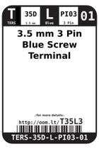
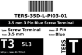
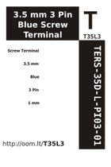

Contents
========

* [T35L3 > 3.5 mm 3 Pin Blue Screw Terminal](#t35l3--35-mm-3-pin-blue-screw-terminal)
	* [Datasheets](#datasheets)
	* [Labels](#labels)
	* [EDA](#eda)
	* [Images](#images)
	* [Tags](#tags)

# T35L3 > 3.5 mm 3 Pin Blue Screw Terminal

- ID: TERS-35D-L-PI03-01
- Hex ID: T35L3
- Name: 3.5 mm 3 Pin Blue Screw Terminal
- Description: 3.5 mm 3 Pin Blue Screw Terminal
- Long Link: [http://oom.lt/TERS-35D-L-PI03-01](http://oom.lt/TERS-35D-L-PI03-01)
- Short Link: [http://oom.lt/T35L3](http://oom.lt/T35L3)

## Datasheets

- Datasheet: [datasheet.pdf](datasheet.pdf)

## Labels
  
  

|label-front|label-inventory|label-spec|
| :---: | :---: | :---: |
||||

## EDA

### Instances
  
  
Used 18 times.  
Prevalance: (18\10986) 0.1638%  

|OOMP Instances|
| :---: |
|[PROJ-ADAF-1752-STAN-01  Adafruit MAX9744 Amplifier PCB  Used 1 times. X1](https://github.com/oomlout/oomlout_OOMP_projects/tree/main/PROJ-ADAF-1752-STAN-01/)|
|[PROJ-ADAF-2923-STAN-01  Adafruit Relay FeatherWing PCBs  Used 1 times. X2](https://github.com/oomlout/oomlout_OOMP_projects/tree/main/PROJ-ADAF-2923-STAN-01/)|
|[PROJ-ADAF-2926-STAN-01  Adafruit Terminal Block FeatherWing PCB  Used 8 times. X5, X6, X7, X8, X9, X10, X11, X12](https://github.com/oomlout/oomlout_OOMP_projects/tree/main/PROJ-ADAF-2926-STAN-01/)|
|[PROJ-ADAF-4409-STAN-01  Adafruit STEMMA Non Latching Mini Relay PCB  Used 1 times. X3](https://github.com/oomlout/oomlout_OOMP_projects/tree/main/PROJ-ADAF-4409-STAN-01/)|
|[PROJ-ADAF-4759-STAN-01  Adafruit Feather M4 CAN PCB  Used 1 times. X4](https://github.com/oomlout/oomlout_OOMP_projects/tree/main/PROJ-ADAF-4759-STAN-01/)|
|[PROJ-SPAR-10124-STAN-01  RS-485 Breakout  Used 1 times. JP2](https://github.com/oomlout/oomlout_OOMP_projects/tree/main/PROJ-SPAR-10124-STAN-01/)|
|[PROJ-SPAR-12959-STAN-01  MOSFET Power Control Kit  Used 1 times. JP4](https://github.com/oomlout/oomlout_OOMP_projects/tree/main/PROJ-SPAR-12959-STAN-01/)|
|[PROJ-SPAR-13261-STAN-01  OpenScale  Used 1 times. JP4](https://github.com/oomlout/oomlout_OOMP_projects/tree/main/PROJ-SPAR-13261-STAN-01/)|
|[PROJ-SPAR-13815-STAN-01  Beefcake Relay Control Kit  Used 1 times. J2](https://github.com/oomlout/oomlout_OOMP_projects/tree/main/PROJ-SPAR-13815-STAN-01/)|
|[PROJ-SPAR-14153-STAN-01  ESP32 Environment Sensor Shield  Used 1 times. J7](https://github.com/oomlout/oomlout_OOMP_projects/tree/main/PROJ-SPAR-14153-STAN-01/)|
|[PROJ-SPAR-14155-STAN-01  ESP32 Power Control Shield  Used 1 times. J3](https://github.com/oomlout/oomlout_OOMP_projects/tree/main/PROJ-SPAR-14155-STAN-01/)|

### Symbols

## Images
  
  

|label-front|label-inventory|label-spec|
| :---: | :---: | :---: |
||||

## Tags

- oompType: TERS
- oompSize: 35D
- oompColor: L
- oompDesc: PI03
- oompIndex: 01
- hexID: T35L3
- oompID: TERS-35D-L-PI03-01
- oompInstances: {'PROJECT': 'PROJ-ADAF-1752-STAN-01', 'ID': 'X1'}
- oompInstances: {'PROJECT': 'PROJ-ADAF-2923-STAN-01', 'ID': 'X2'}
- oompInstances: {'PROJECT': 'PROJ-ADAF-2926-STAN-01', 'ID': 'X5'}
- oompInstances: {'PROJECT': 'PROJ-ADAF-2926-STAN-01', 'ID': 'X6'}
- oompInstances: {'PROJECT': 'PROJ-ADAF-2926-STAN-01', 'ID': 'X7'}
- oompInstances: {'PROJECT': 'PROJ-ADAF-2926-STAN-01', 'ID': 'X8'}
- oompInstances: {'PROJECT': 'PROJ-ADAF-2926-STAN-01', 'ID': 'X9'}
- oompInstances: {'PROJECT': 'PROJ-ADAF-2926-STAN-01', 'ID': 'X10'}
- oompInstances: {'PROJECT': 'PROJ-ADAF-2926-STAN-01', 'ID': 'X11'}
- oompInstances: {'PROJECT': 'PROJ-ADAF-2926-STAN-01', 'ID': 'X12'}
- oompInstances: {'PROJECT': 'PROJ-ADAF-4409-STAN-01', 'ID': 'X3'}
- oompInstances: {'PROJECT': 'PROJ-ADAF-4759-STAN-01', 'ID': 'X4'}
- oompInstances: {'PROJECT': 'PROJ-SPAR-10124-STAN-01', 'ID': 'JP2'}
- oompInstances: {'PROJECT': 'PROJ-SPAR-12959-STAN-01', 'ID': 'JP4'}
- oompInstances: {'PROJECT': 'PROJ-SPAR-13261-STAN-01', 'ID': 'JP4'}
- oompInstances: {'PROJECT': 'PROJ-SPAR-13815-STAN-01', 'ID': 'J2'}
- oompInstances: {'PROJECT': 'PROJ-SPAR-14153-STAN-01', 'ID': 'J7'}
- oompInstances: {'PROJECT': 'PROJ-SPAR-14155-STAN-01', 'ID': 'J3'}
