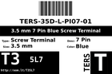
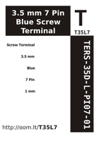

Contents
========

* [T35L7 > ](#t35l7--)
	* [Labels](#labels)
	* [EDA](#eda)
	* [Images](#images)
	* [Tags](#tags)

# T35L7 > 

- ID: TERS-35D-L-PI07-01
- Hex ID: T35L7
- Name: 
- Description: 
- Long Link: [http://oom.lt/TERS-35D-L-PI07-01](http://oom.lt/TERS-35D-L-PI07-01)
- Short Link: [http://oom.lt/T35L7](http://oom.lt/T35L7)

## Labels
  
  

|label-front|label-inventory|label-spec|
| :---: | :---: | :---: |
||||

## EDA

### Footprints
  

|[  FOOTPRINT-kicad-kicad-footprints-TerminalBlock_4Ucon-TerminalBlock_4Ucon_1x07_P3.50mm_Vertical](https://github.com/oomlout/oomlout_OOMP_eda/tree/main/FOOTPRINT/kicad/kicad-footprints/TerminalBlock_4Ucon/TerminalBlock_4Ucon_1x07_P3.50mm_Vertical/)||||
| :---: | :---: | :---: | :---: |

### Symbols
  

|[  SYMBOL-kicad-kicad-symbols-Connector-Screw_Terminal_01x07](https://github.com/oomlout/oomlout_OOMP_eda/tree/main/SYMBOL/kicad/kicad-symbols/Connector/Screw_Terminal_01x07/)||||
| :---: | :---: | :---: | :---: |

## Images
  
  

|label-front|label-inventory|label-spec|
| :---: | :---: | :---: |
||||

## Tags

- oompType: TERS
- oompSize: 35D
- oompColor: L
- oompDesc: PI07
- oompIndex: 01
- hexID: T35L7
- oompID: TERS-35D-L-PI07-01
- footprintKicad: FOOTPRINT-kicad-kicad-footprints-TerminalBlock_4Ucon-TerminalBlock_4Ucon_1x07_P3.50mm_Vertical
- symbolKicad: SYMBOL-kicad-kicad-symbols-Connector-Screw_Terminal_01x07
