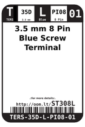
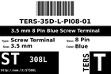
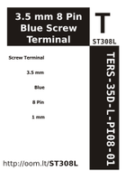

Contents
========

* [T35L8 > 3.5 mm 8 Pin Blue Screw Terminal](#t35l8--35-mm-8-pin-blue-screw-terminal)
	* [Datasheets](#datasheets)
	* [Labels](#labels)
	* [EDA](#eda)
	* [Images](#images)
	* [Tags](#tags)

# T35L8 > 3.5 mm 8 Pin Blue Screw Terminal

- ID: TERS-35D-L-PI08-01
- Hex ID: T35L8
- Name: 3.5 mm 8 Pin Blue Screw Terminal
- Description: 3.5 mm 8 Pin Blue Screw Terminal
- Long Link: [http://oom.lt/TERS-35D-L-PI08-01](http://oom.lt/TERS-35D-L-PI08-01)
- Short Link: [http://oom.lt/T35L8](http://oom.lt/T35L8)

## Datasheets

- Datasheet: [datasheet.pdf](datasheet.pdf)

## Labels
  
  

|label-front|label-inventory|label-spec|
| :---: | :---: | :---: |
||||

## EDA

### Footprints
  

|  [FOOTPRINT-kicad-kicad-footprints-TerminalBlock_4Ucon-TerminalBlock_4Ucon_1x08_P3.50mm_Vertical](https://github.com/oomlout/oomlout_OOMP_eda/tree/main/FOOTPRINT/kicad/kicad-footprints/TerminalBlock_4Ucon/TerminalBlock_4Ucon_1x08_P3.50mm_Vertical/)||||
| :---: | :---: | :---: | :---: |

### Symbols
  

|  [SYMBOL-kicad-kicad-symbols-Connector-Screw_Terminal_01x08](https://github.com/oomlout/oomlout_OOMP_parts/tree/main/SYMBOL-kicad-kicad-symbols-Connector-Screw_Terminal_01x08/)||||
| :---: | :---: | :---: | :---: |

## Images
  
  

|label-front|label-inventory|label-spec|
| :---: | :---: | :---: |
||||

## Tags

- oompType: TERS
- oompSize: 35D
- oompColor: L
- oompDesc: PI08
- oompIndex: 01
- hexID: T35L8
- oompID: TERS-35D-L-PI08-01
- footprintKicad: FOOTPRINT-kicad-kicad-footprints-TerminalBlock_4Ucon-TerminalBlock_4Ucon_1x08_P3.50mm_Vertical
- symbolKicad: SYMBOL-kicad-kicad-symbols-Connector-Screw_Terminal_01x08
