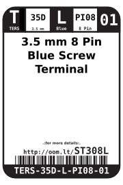
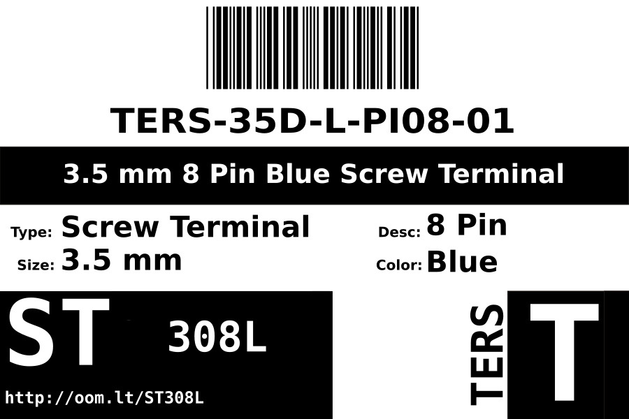

Contents
========

* [TERS-35D-L-PI08-01>3.5 mm 8 Pin Blue Screw Terminal](#ters-35d-l-pi08-0135-mm-8-pin-blue-screw-terminal)
	* [Datasheets](#datasheets)
	* [Labels](#labels)
	* [EDA](#eda)
		* [Symbols](#symbols)
	* [Tags](#tags)

# TERS-35D-L-PI08-01>3.5 mm 8 Pin Blue Screw Terminal

- ID: TERS-35D-L-PI08-01
- Name: TERS-35D-L-PI08-01

## Datasheets

- Datasheet: [datasheet.pdf](datasheet.pdf)

## Labels
  
  

|label-front|label-inventory|label-spec|
| :---: | :---: | :---: |
||||

## EDA

### Symbols

## Tags

- oompID: TERS-35D-L-PI08-01
- name: 3.5 mm 8 Pin Blue Screw Terminal
- hexID: ST308L
- oompSort: TERS35D08PI
- oompClass: Through Hole
- oompClassCode: THTH
- oompType: TERS
- oompSize: 35D
- oompColor: L
- oompDesc: PI08
- oompIndex: 01
- oompVersion: 98
- ooPitch: 3.5mm
- ooNumPins: 8
- ooFootprint: OOMP-TERS-35D-X-PI08-01
- ooDesignator: J1
