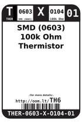
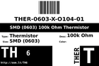

Contents
========

* [TH6 > SMD (0603) 100k Ohm Thermistor](#th6--smd-0603-100k-ohm-thermistor)
	* [Datasheets](#datasheets)
	* [Labels](#labels)
	* [EDA](#eda)
	* [Images](#images)
	* [Tags](#tags)

# TH6 > SMD (0603) 100k Ohm Thermistor

- ID: THER-0603-X-O104-01
- Hex ID: TH6
- Name: SMD (0603) 100k Ohm Thermistor
- Description: SMD (0603) 100k Ohm Thermistor
- Long Link: [http://oom.lt/THER-0603-X-O104-01](http://oom.lt/THER-0603-X-O104-01)
- Short Link: [http://oom.lt/TH6](http://oom.lt/TH6)

## Datasheets

- Datasheet: [datasheet.pdf](datasheet.pdf)

## Labels
  
  

|label-front|label-inventory|label-spec|
| :---: | :---: | :---: |
||||

## EDA

### Symbols

## Images
  
  

|label-front|label-inventory|label-spec|
| :---: | :---: | :---: |
||||

## Tags

- oompID: THER-0603-X-O104-01
- name: SMD (0603) 100k Ohm Thermistor
- hexID: TH6
- oompSort: THER0603O104
- oompType: THER
- oompSize: 0603
- oompColor: X
- oompDesc: O104
- oompIndex: 01
- oompVersion: 98
- ooWidth: 0.8 mm
- ooLength: 1.6 mm
- ooDesignator: RT1
