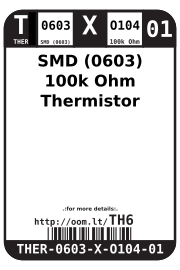
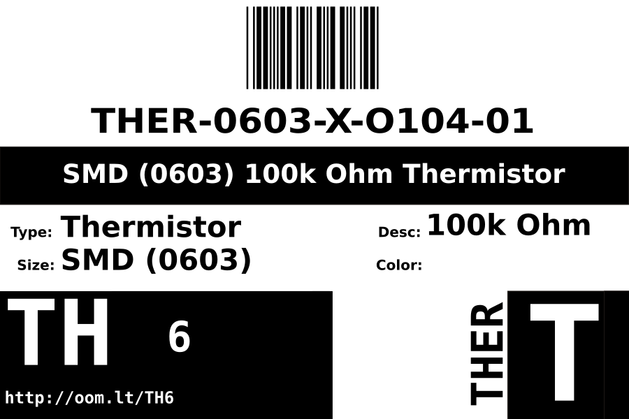
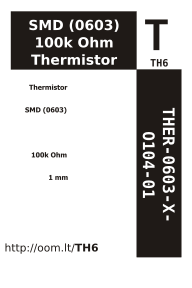

Contents
========

* [THER-0603-X-O104-01>SMD (0603) 100k Ohm Thermistor](#ther-0603-x-o104-01smd-0603-100k-ohm-thermistor)
	* [Datasheets](#datasheets)
	* [Labels](#labels)
	* [EDA](#eda)
		* [Symbols](#symbols)
	* [Tags](#tags)

# THER-0603-X-O104-01>SMD (0603) 100k Ohm Thermistor

- ID: THER-0603-X-O104-01
- Name: THER-0603-X-O104-01

## Datasheets

- Datasheet: [datasheet.pdf](datasheet.pdf)

## Labels
  
  

|Front|Inventory|Specifications|
| :---: | :---: | :---: |
||||

## EDA

### Symbols

## Tags

- oompID: THER-0603-X-O104-01
- name: SMD (0603) 100k Ohm Thermistor
- hexID: TH6
- oompSort: THER0603O104
- oompType: THER
- oompSize: 0603
- oompColor: X
- oompDesc: O104
- oompIndex: 01
- oompVersion: 98
- ooWidth: 0.8 mm
- ooLength: 1.6 mm
- ooDesignator: RT1
