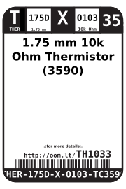
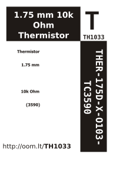

Contents
========

* [THER-175D-X-O103-TC3590>1.75 mm 10k Ohm Thermistor (3590)](#ther-175d-x-o103-tc3590175-mm-10k-ohm-thermistor-3590)
	* [Labels](#labels)
	* [EDA](#eda)
		* [Symbols](#symbols)
	* [Tags](#tags)

# THER-175D-X-O103-TC3590>1.75 mm 10k Ohm Thermistor (3590)

- ID: THER-175D-X-O103-TC3590
- Name: THER-175D-X-O103-TC3590

## Labels
  
  

|label-front|label-inventory|label-spec|
| :---: | :---: | :---: |
||||

## EDA

### Symbols

## Tags

- oompType: THER
- oompSize: 175D
- oompColor: X
- oompDesc: O103
- oompIndex: TC3590
- hexID: TH1033
