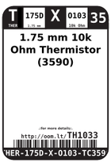
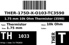
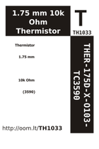

Contents
========

* [TH1033 > 1.75 mm 10k Ohm Thermistor (3590)](#th1033--175-mm-10k-ohm-thermistor-3590)
	* [Labels](#labels)
	* [EDA](#eda)
	* [Images](#images)
	* [Tags](#tags)

# TH1033 > 1.75 mm 10k Ohm Thermistor (3590)

- ID: THER-175D-X-O103-TC3590
- Hex ID: TH1033
- Name: 1.75 mm 10k Ohm Thermistor (3590)
- Description: 1.75 mm 10k Ohm Thermistor (3590)
- Long Link: [http://oom.lt/THER-175D-X-O103-TC3590](http://oom.lt/THER-175D-X-O103-TC3590)
- Short Link: [http://oom.lt/TH1033](http://oom.lt/TH1033)

## Labels
  
  

|label-front|label-inventory|label-spec|
| :---: | :---: | :---: |
||||

## EDA

### Symbols

## Images
  
  

|label-front|label-inventory|label-spec|
| :---: | :---: | :---: |
||||

## Tags

- oompType: THER
- oompSize: 175D
- oompColor: X
- oompDesc: O103
- oompIndex: TC3590
- hexID: TH1033
- oompID: THER-175D-X-O103-TC3590
