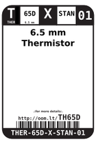
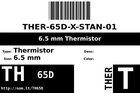

Contents
========

* [TH65D > 6.5 mm Thermistor](#th65d--65-mm-thermistor)
	* [Datasheets](#datasheets)
	* [Labels](#labels)
	* [EDA](#eda)
	* [Images](#images)
	* [Tags](#tags)
  
![][im]
# TH65D > 6.5 mm Thermistor

- ID: THER-65D-X-STAN-01
- Hex ID: TH65D
- Name: 6.5 mm Thermistor
- Description: 6.5 mm Thermistor
- Long Link: [http://oom.lt/THER-65D-X-STAN-01](http://oom.lt/THER-65D-X-STAN-01)
- Short Link: [http://oom.lt/TH65D](http://oom.lt/TH65D)

## Datasheets

- Datasheet: [datasheet.pdf](datasheet.pdf)

## Labels
  
  

|label-front|label-inventory|label-spec|
| :---: | :---: | :---: |
||||

## EDA

## Images
  
  

|image|image_RE|label-front|label-inventory|label-spec|
| :---: | :---: | :---: | :---: | :---: |
||||||

## Tags

- oompID: THER-65D-X-STAN-01
- name: 6.5 mm Thermistor
- hexID: TH65D
- oompSort: THER65DSTAN
- oompType: THER
- oompSize: 65D
- oompColor: X
- oompDesc: STAN
- oompIndex: 01
- oompVersion: 98
- ooDesignator: RT

[im]: image_450.jpg
