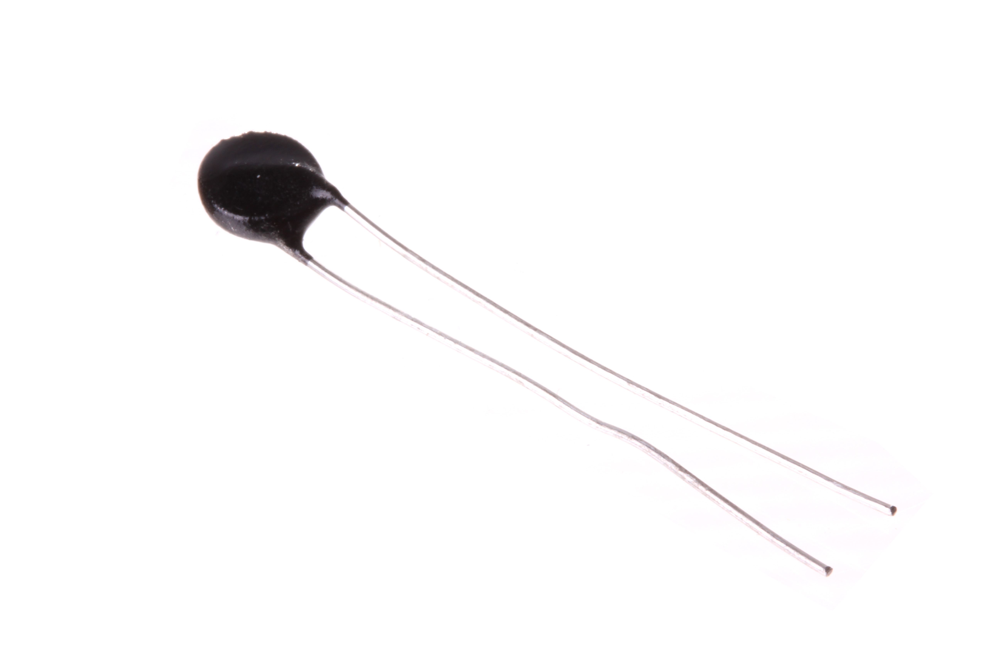
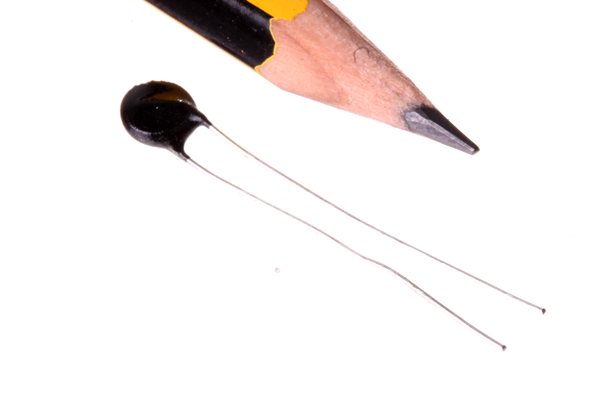
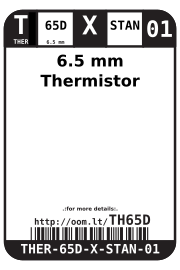
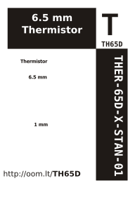

Contents
========

* [THER-65D-X-STAN-01>6.5 mm Thermistor](#ther-65d-x-stan-0165-mm-thermistor)
	* [Images](#images)
	* [Datasheets](#datasheets)
	* [Labels](#labels)
	* [EDA](#eda)
		* [Symbols](#symbols)
	* [Tags](#tags)
  
![][im]
# THER-65D-X-STAN-01>6.5 mm Thermistor

- ID: THER-65D-X-STAN-01
- Name: THER-65D-X-STAN-01

## Images
  
  

|Main|Reference|
| :---: | :---: |
|||

## Datasheets

- Datasheet: [datasheet.pdf](datasheet.pdf)

## Labels
  
  

|Front|Inventory|Specifications|
| :---: | :---: | :---: |
||||

## EDA

### Symbols

## Tags

- oompID: THER-65D-X-STAN-01
- name: 6.5 mm Thermistor
- hexID: TH65D
- oompSort: THER65DSTAN
- oompType: THER
- oompSize: 65D
- oompColor: X
- oompDesc: STAN
- oompIndex: 01
- oompVersion: 98
- ooDesignator: RT

[im]: image_600.jpg
