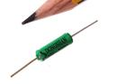
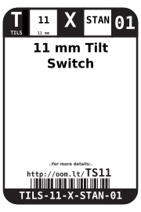
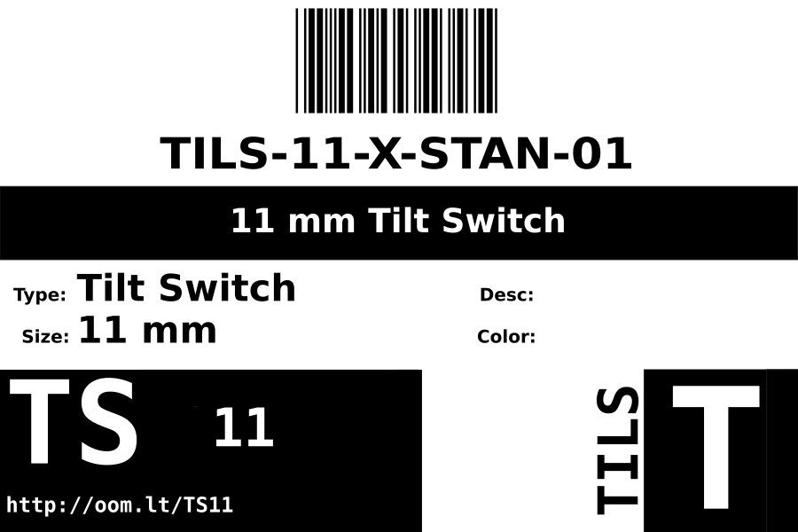

Contents
========

* [TILS-11-X-STAN-01>11 mm Tilt Switch](#tils-11-x-stan-0111-mm-tilt-switch)
	* [Images](#images)
	* [Datasheets](#datasheets)
	* [Labels](#labels)
	* [EDA](#eda)
		* [Symbols](#symbols)
	* [Tags](#tags)
  
![][im]
# TILS-11-X-STAN-01>11 mm Tilt Switch

- ID: TILS-11-X-STAN-01
- Name: TILS-11-X-STAN-01

## Images
  
  

|image|image_RE|
| :---: | :---: |
|||

## Datasheets

- Datasheet: [datasheet.pdf](datasheet.pdf)

## Labels
  
  

|label-front|label-inventory|label-spec|
| :---: | :---: | :---: |
||||

## EDA

### Symbols

## Tags

- oompID: TILS-11-X-STAN-01
- name: 11 mm Tilt Switch
- hexID: TS11
- oompSort: TILS11STAN
- oompType: TILS
- oompSize: 11
- oompColor: X
- oompDesc: STAN
- oompIndex: 01
- oompVersion: 98
- ooDiameter: 3.4 mm
- ooLength: 11 mm
- ooNumPins: 2
- ooDesignator: S1

[im]: image_600.jpg
