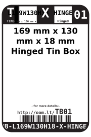
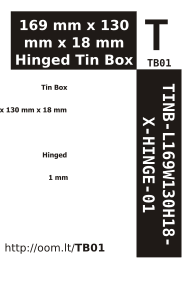

Contents
========

* [TINB-L169W130H18-X-HINGE-01>169 mm x 130 mm x 18 mm Hinged Tin Box](#tinb-l169w130h18-x-hinge-01169-mm-x-130-mm-x-18-mm-hinged-tin-box)
	* [Labels](#labels)
	* [EDA](#eda)
		* [Symbols](#symbols)
	* [Tags](#tags)

# TINB-L169W130H18-X-HINGE-01>169 mm x 130 mm x 18 mm Hinged Tin Box

- ID: TINB-L169W130H18-X-HINGE-01
- Name: TINB-L169W130H18-X-HINGE-01

## Labels
  
  

|label-front|label-inventory|label-spec|
| :---: | :---: | :---: |
||||

## EDA

### Symbols

## Tags

- oompType: TINB
- oompSize: L169W130H18
- oompColor: X
- oompDesc: HINGE
- oompIndex: 01
- manufacturersPartNumber: Tinware,T4066
- hexID: TB01
