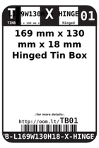
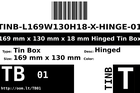
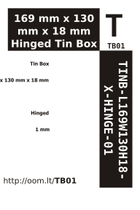

Contents
========

* [TB01 > ](#tb01--)
	* [Labels](#labels)
	* [EDA](#eda)
	* [Images](#images)
	* [Tags](#tags)

# TB01 > 

- ID: TINB-L169W130H18-X-HINGE-01
- Hex ID: TB01
- Name: 
- Description: 
- Long Link: [http://oom.lt/TINB-L169W130H18-X-HINGE-01](http://oom.lt/TINB-L169W130H18-X-HINGE-01)
- Short Link: [http://oom.lt/TB01](http://oom.lt/TB01)

## Labels
  
  

|label-front|label-inventory|label-spec|
| :---: | :---: | :---: |
||||

## EDA

## Images
  
  

|label-front|label-inventory|label-spec|
| :---: | :---: | :---: |
||||

## Tags

- oompType: TINB
- oompSize: L169W130H18
- oompColor: X
- oompDesc: HINGE
- oompIndex: 01
- manufacturersPartNumber: Tinware,T4066
- hexID: TB01
- oompID: TINB-L169W130H18-X-HINGE-01
