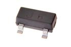
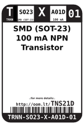

Contents
========

* [TNS21D > SMD (SOT-23) 100 mA NPN Transistor](#tns21d--smd-sot-23-100-ma-npn-transistor)
	* [Images](#images)
	* [Datasheets](#datasheets)
	* [Labels](#labels)
	* [EDA](#eda)
	* [Tags](#tags)
  
![][im]
# TNS21D > SMD (SOT-23) 100 mA NPN Transistor

- ID: TRNN-SO23-X-A01D-01
- Hex ID: TNS21D
- Name: SMD (SOT-23) 100 mA NPN Transistor
- Description: SMD (SOT-23) 100 mA NPN Transistor

## Images
  
  

|image|image_BOTTOM|label-front|label-inventory|label-spec|
| :---: | :---: | :---: | :---: | :---: |
||||||

## Datasheets

- Datasheet: [datasheet.pdf](datasheet.pdf)

## Labels
  
  

|label-front|label-inventory|label-spec|
| :---: | :---: | :---: |
||||

## EDA

### Symbols

## Tags

- oompID: TRNN-SO23-X-A01D-01
- name: SMD (SOT-23) 100 mA NPN Transistor
- hexID: TNS21D
- oompSort: 
- oompClass: Surface Mount
- oompClassCode: SMDS
- oompType: TRNN
- oompSize: SO23
- oompColor: X
- oompDesc: A01D
- oompIndex: 01
- oompVersion: 40
- ooPin1: B
- ooPin2: E
- ooPin3: C
- oompBbls: template;XXXX-SO23-X-XXXX-01-bbls
- oompDiag: template;XXXX-SO23-X-XXXX-01-diag
- oompIden: template;XXXX-SO23-X-XXXX-01-iden
- oompSimp: template;XXXX-SO23-X-XXXX-01-simp
- ooPackageMarking: J6
- ooDesignator: Q1

[im]: image_450.jpg
