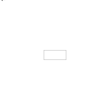
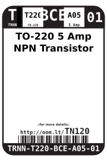

Contents
========

* [TRNN-T220-BCE-A05-01>TO-220 5 Amp NPN Transistor](#trnn-t220-bce-a05-01to-220-5-amp-npn-transistor)
	* [Diagrams](#diagrams)
	* [Datasheets](#datasheets)
	* [Labels](#labels)
	* [EDA](#eda)
		* [Symbols](#symbols)
	* [Tags](#tags)

# TRNN-T220-BCE-A05-01>TO-220 5 Amp NPN Transistor

- ID: TRNN-T220-BCE-A05-01
- Name: TRNN-T220-BCE-A05-01

## Diagrams
  
  

|Breadboard Layout|Diagram|Identifier|Schematic|Simple|
| :---: | :---: | :---: | :---: | :---: |
||||||

## Datasheets

- Datasheet: [datasheet.pdf](datasheet.pdf)

## Labels
  
  

|Front|Inventory|Specifications|
| :---: | :---: | :---: |
||||

## EDA

### Symbols

## Tags

- oompType: TRNN
- oompSize: T220
- oompColor: BCE
- oompDesc: A05
- oompIndex: 01
- hexID: TN120
- oompSort: TRNNT220A05
- ooPitch: 2.54
- ooNumPins: 3
- ooMaxCurrent: 5 Amp
- ooPin1: B
- ooPin2: C
- ooPin3: E
- oompBbls: template;XXXX-T220-X-XXXX-01-bbls
- oompDiag: template;XXXX-T220-X-XXXX-01-diag
- oompIden: template;XXXX-T220-X-XXXX-01-iden
- oompSimp: template;XXXX-T220-X-XXXX-01-simp
- ooPackageMarking: TIP120
- ooDesignator: Q1
- kicadSymbol: Transistor_BLT>TIP120
- kicadFootprint: Package_TO_SOT_THT:TO-220-3_Vertical
