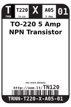
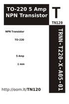

Contents
========

* [TN120 > TO-220 5 Amp NPN Transistor](#tn120--to-220-5-amp-npn-transistor)
	* [Datasheets](#datasheets)
	* [Labels](#labels)
	* [EDA](#eda)
	* [Images](#images)
	* [Tags](#tags)

# TN120 > TO-220 5 Amp NPN Transistor

- ID: TRNN-T220-X-A05-01
- Hex ID: TN120
- Name: TO-220 5 Amp NPN Transistor
- Description: TO-220 5 Amp NPN Transistor
- Long Link: [http://oom.lt/TRNN-T220-X-A05-01](http://oom.lt/TRNN-T220-X-A05-01)
- Short Link: [http://oom.lt/TN120](http://oom.lt/TN120)

## Datasheets

- Datasheet: [datasheet.pdf](datasheet.pdf)

## Labels
  
  

|label-front|label-inventory|label-spec|
| :---: | :---: | :---: |
||||

## EDA

### Symbols

## Images
  
  

|label-front|label-inventory|label-spec|
| :---: | :---: | :---: |
||||

## Tags

- oompID: TRNN-T220-X-A05-01
- name: TO-220 5 Amp NPN Transistor
- hexID: TN120
- oompSort: TRNNT220A05
- oompType: TRNN
- oompSize: T220
- oompColor: X
- oompDesc: A05
- oompIndex: 01
- oompVersion: 98
- ooPitch: 2.54
- ooNumPins: 3
- ooMaxCurrent: 5 Amp
- ooPin1: B
- ooPin2: C
- ooPin3: E
- oompBbls: template;XXXX-T220-X-XXXX-01-bbls
- oompDiag: template;XXXX-T220-X-XXXX-01-diag
- oompIden: template;XXXX-T220-X-XXXX-01-iden
- oompSimp: template;XXXX-T220-X-XXXX-01-simp
- ooPackageMarking: TIP120
- ooDesignator: Q1
