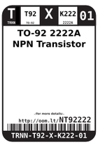

Contents
========

* [NT92222 > TO-92 2222A NPN Transistor](#nt92222--to-92-2222a-npn-transistor)
	* [Datasheets](#datasheets)
	* [Labels](#labels)
	* [EDA](#eda)
	* [Images](#images)
	* [Tags](#tags)
  
![][im]
# NT92222 > TO-92 2222A NPN Transistor

- ID: TRNN-T92-X-K222-01
- Hex ID: NT92222
- Name: TO-92 2222A NPN Transistor
- Description: TO-92 2222A NPN Transistor
- Long Link: [http://oom.lt/TRNN-T92-X-K222-01](http://oom.lt/TRNN-T92-X-K222-01)
- Short Link: [http://oom.lt/NT92222](http://oom.lt/NT92222)

## Datasheets

- Datasheet: [datasheet.pdf](datasheet.pdf)

## Labels
  
  

|label-front|label-inventory|label-spec|
| :---: | :---: | :---: |
||||

## EDA

### Symbols

## Images
  
  

|image|label-front|label-inventory|label-spec|
| :---: | :---: | :---: | :---: |
|||||

## Tags

- oompID: TRNN-T92-X-K222-01
- name: TO-92 2222A NPN Transistor
- hexID: NT92222
- oompSort: 0T922222
- oompType: TRNN
- oompSize: T92
- oompColor: X
- oompDesc: K222
- oompIndex: 01
- oompVersion: 99
- ooManufacturer: ON Semi
- ooManufacturerPartNumber: P2N2222AG ON Semi
- oompClass: Through Hole Component
- oompClassCode: THTH
- ooDesignator: Q1

[im]: image_450.jpg
