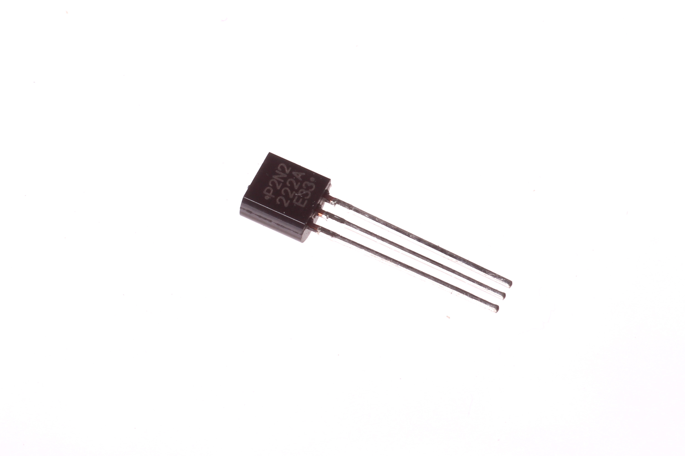

Contents
========

* [TRNN-T92-X-K222-01>TO-92 2222A NPN Transistor](#trnn-t92-x-k222-01to-92-2222a-npn-transistor)
	* [Images](#images)
	* [Datasheets](#datasheets)
	* [Labels](#labels)
	* [EDA](#eda)
		* [Symbols](#symbols)
	* [Tags](#tags)
  
![][im]
# TRNN-T92-X-K222-01>TO-92 2222A NPN Transistor

- ID: TRNN-T92-X-K222-01
- Name: TRNN-T92-X-K222-01

## Images
  
  

|Main|
| :---: |
||

## Datasheets

- Datasheet: [datasheet.pdf](datasheet.pdf)

## Labels
  
  

|Front|Inventory|Specifications|
| :---: | :---: | :---: |
||||

## EDA

### Symbols

## Tags

- index: 13091
- index: 4271
- oompID: TRNN-T92-X-K222-01
- name: TO-92 2222A NPN Transistor
- hexID: NT92222
- oompSort: 0T922222
- oompType: TRNN
- oompSize: T92
- oompColor: X
- oompDesc: K222
- oompIndex: 01
- oompVersion: 99
- ooManufacturer: ON Semi
- ooManufacturerPartNumber: P2N2222AG ON Semi
- oompClass: Through Hole Component
- oompClassCode: THTH
- ooDesignator: Q1

[im]: image_600.jpg
