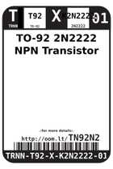
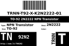
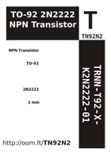

Contents
========

* [TN92N2 > TO-92 2N2222 NPN Transistor](#tn92n2--to-92-2n2222-npn-transistor)
	* [Images](#images)
	* [Labels](#labels)
	* [EDA](#eda)
	* [Tags](#tags)

# TN92N2 > TO-92 2N2222 NPN Transistor

- ID: TRNN-T92-X-K2N2222-01
- Hex ID: TN92N2
- Name: TO-92 2N2222 NPN Transistor
- Description: TO-92 2N2222 NPN Transistor

## Images
  
  

|label-front|label-inventory|label-spec|
| :---: | :---: | :---: |
||||

## Labels
  
  

|label-front|label-inventory|label-spec|
| :---: | :---: | :---: |
||||

## EDA

### Symbols

## Tags

- oompType: TRNN
- oompSize: T92
- oompColor: X
- oompDesc: K2N2222
- oompIndex: 01
- hexID: TN92N2
- oompID: TRNN-T92-X-K2N2222-01
