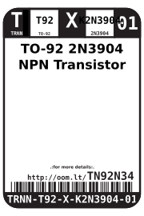
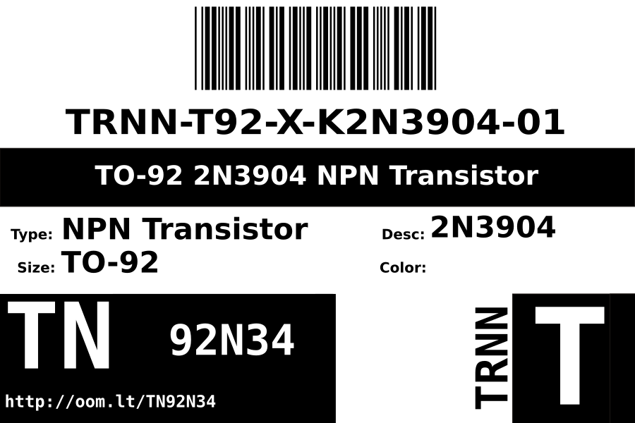
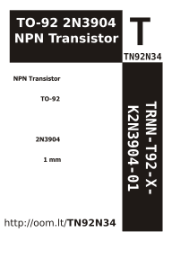

Contents
========

* [TRNN-T92-X-K2N3904-01>TO-92 2N3904 NPN Transistor](#trnn-t92-x-k2n3904-01to-92-2n3904-npn-transistor)
	* [Labels](#labels)
	* [EDA](#eda)
		* [Symbols](#symbols)
	* [Tags](#tags)

# TRNN-T92-X-K2N3904-01>TO-92 2N3904 NPN Transistor

- ID: TRNN-T92-X-K2N3904-01
- Name: TRNN-T92-X-K2N3904-01

## Labels
  
  

|label-front|label-inventory|label-spec|
| :---: | :---: | :---: |
||||

## EDA

### Symbols

## Tags

- oompType: TRNN
- oompSize: T92
- oompColor: X
- oompDesc: K2N3904
- oompIndex: 01
- hexID: TN92N34
