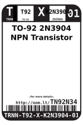

Contents
========

* [TN92N34 > ](#tn92n34--)
	* [Labels](#labels)
	* [EDA](#eda)
	* [Images](#images)
	* [Tags](#tags)

# TN92N34 > 

- ID: TRNN-T92-X-K2N3904-01
- Hex ID: TN92N34
- Name: 
- Description: 
- Long Link: [http://oom.lt/TRNN-T92-X-K2N3904-01](http://oom.lt/TRNN-T92-X-K2N3904-01)
- Short Link: [http://oom.lt/TN92N34](http://oom.lt/TN92N34)

## Labels
  
  

|label-front|label-inventory|label-spec|
| :---: | :---: | :---: |
||||

## EDA

## Images
  
  

|label-front|label-inventory|label-spec|
| :---: | :---: | :---: |
||||

## Tags

- oompType: TRNN
- oompSize: T92
- oompColor: X
- oompDesc: K2N3904
- oompIndex: 01
- hexID: TN92N34
- oompID: TRNN-T92-X-K2N3904-01
