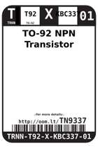
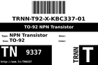
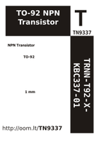

Contents
========

* [TN9337 > ](#tn9337--)
	* [Datasheets](#datasheets)
	* [Labels](#labels)
	* [EDA](#eda)
	* [Images](#images)
	* [Tags](#tags)

# TN9337 > 

- ID: TRNN-T92-X-KBC337-01
- Hex ID: TN9337
- Name: 
- Description: 
- Long Link: [http://oom.lt/TRNN-T92-X-KBC337-01](http://oom.lt/TRNN-T92-X-KBC337-01)
- Short Link: [http://oom.lt/TN9337](http://oom.lt/TN9337)

## Datasheets

- Datasheet: [datasheet.pdf](datasheet.pdf)

## Labels
  
  

|label-front|label-inventory|label-spec|
| :---: | :---: | :---: |
||||

## EDA

## Images
  
  

|label-front|label-inventory|label-spec|
| :---: | :---: | :---: |
||||

## Tags

- oompType: TRNN
- oompSize: T92
- oompColor: X
- oompDesc: KBC337
- oompIndex: 01
- hexID: TN9337
- oompID: TRNN-T92-X-KBC337-01
