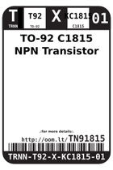
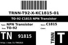
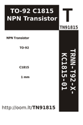

Contents
========

* [TN91815 > TO-92 C1815 NPN Transistor](#tn91815--to-92-c1815-npn-transistor)
	* [Images](#images)
	* [Labels](#labels)
	* [EDA](#eda)
	* [Tags](#tags)

# TN91815 > TO-92 C1815 NPN Transistor

- ID: TRNN-T92-X-KC1815-01
- Hex ID: TN91815
- Name: TO-92 C1815 NPN Transistor
- Description: TO-92 C1815 NPN Transistor

## Images
  
  

|label-front|label-inventory|label-spec|
| :---: | :---: | :---: |
||||

## Labels
  
  

|label-front|label-inventory|label-spec|
| :---: | :---: | :---: |
||||

## EDA

### Symbols

## Tags

- oompType: TRNN
- oompSize: T92
- oompColor: X
- oompDesc: KC1815
- oompIndex: 01
- hexID: TN91815
- oompID: TRNN-T92-X-KC1815-01
