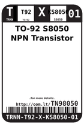
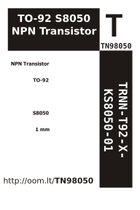

Contents
========

* [TN98050 > TO-92 S8050 NPN Transistor](#tn98050--to-92-s8050-npn-transistor)
	* [Datasheets](#datasheets)
	* [Labels](#labels)
	* [EDA](#eda)
	* [Images](#images)
	* [Tags](#tags)

# TN98050 > TO-92 S8050 NPN Transistor

- ID: TRNN-T92-X-KS8050-01
- Hex ID: TN98050
- Name: TO-92 S8050 NPN Transistor
- Description: TO-92 S8050 NPN Transistor
- Long Link: [http://oom.lt/TRNN-T92-X-KS8050-01](http://oom.lt/TRNN-T92-X-KS8050-01)
- Short Link: [http://oom.lt/TN98050](http://oom.lt/TN98050)

## Datasheets

- Datasheet: [datasheet.pdf](datasheet.pdf)

## Labels
  
  

|label-front|label-inventory|label-spec|
| :---: | :---: | :---: |
||||

## EDA

### Symbols

## Images
  
  

|label-front|label-inventory|label-spec|
| :---: | :---: | :---: |
||||

## Tags

- oompType: TRNN
- oompSize: T92
- oompColor: X
- oompDesc: KS8050
- oompIndex: 01
- hexID: TN98050
- oompID: TRNN-T92-X-KS8050-01
