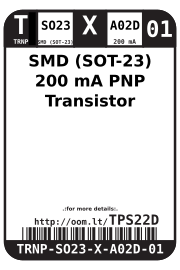
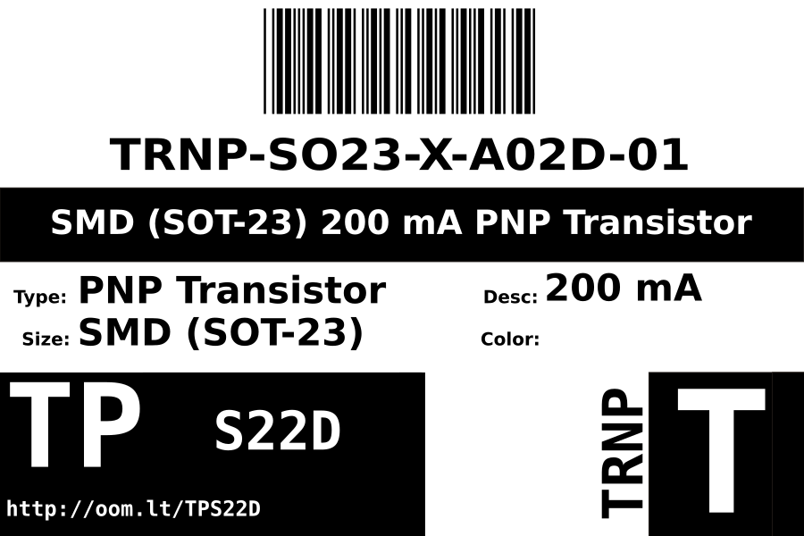

Contents
========

* [TRNP-SO23-X-A02D-01>SMD (SOT-23) 200 mA PNP Transistor](#trnp-so23-x-a02d-01smd-sot-23-200-ma-pnp-transistor)
	* [Datasheets](#datasheets)
	* [Labels](#labels)
	* [EDA](#eda)
		* [Symbols](#symbols)
	* [Tags](#tags)

# TRNP-SO23-X-A02D-01>SMD (SOT-23) 200 mA PNP Transistor

- ID: TRNP-SO23-X-A02D-01
- Name: TRNP-SO23-X-A02D-01

## Datasheets

- Datasheet: [datasheet.pdf](datasheet.pdf)

## Labels
  
  

|Front|Inventory|Specifications|
| :---: | :---: | :---: |
||||

## EDA

### Symbols

## Tags

- index: 793
- oompID: TRNP-SO23-X-A02D-01
- name: SMD (SOT-23) 200 mA PNP Transistor
- hexID: TPS22D
- oompSort: TRNPSO23A02D
- oompType: TRNP
- oompSize: SO23
- oompColor: X
- oompDesc: A02D
- oompIndex: 01
- oompVersion: 98
- ooNumPins: 3
- ooPin1: B
- ooPin2: E
- ooPin3: C
- oompBbls: template;XXXX-SO23-X-XXXX-01-bbls
- oompDiag: template;XXXX-SO23-X-XXXX-01-diag
- oompIden: template;XXXX-SO23-X-XXXX-01-iden
- oompSimp: template;XXXX-SO23-X-XXXX-01-simp
- ooPackageMarking: 2AM
- ooDesignator: U1
