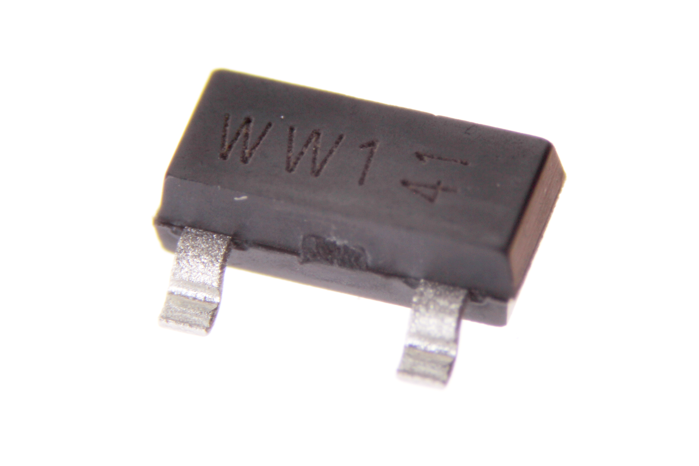
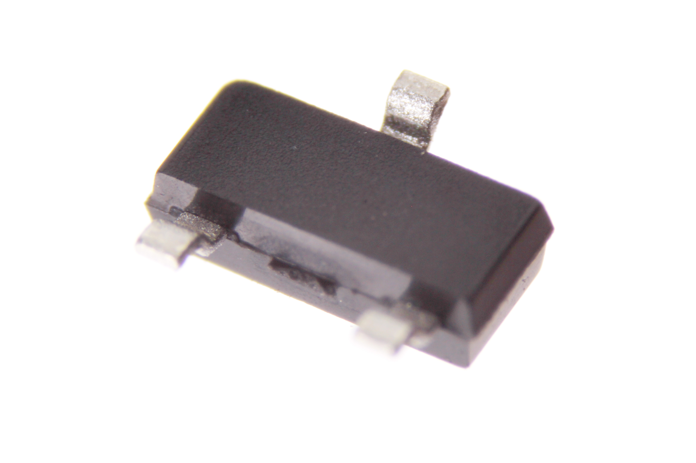

Contents
========

* [TRNP-SO23-X-A05D-01>SMD (SOT-23) 500 mA PNP Transistor](#trnp-so23-x-a05d-01smd-sot-23-500-ma-pnp-transistor)
	* [Images](#images)
	* [Datasheets](#datasheets)
	* [EDA](#eda)
		* [Symbols](#symbols)
	* [Tags](#tags)
  
![][im]
# TRNP-SO23-X-A05D-01>SMD (SOT-23) 500 mA PNP Transistor

- ID: TRNP-SO23-X-A05D-01
- Name: TRNP-SO23-X-A05D-01

## Images
  
  

|Main|Bottom|
| :---: | :---: |
|||

## Datasheets

- Datasheet: [datasheet.pdf](datasheet.pdf)

## EDA

### Symbols

## Tags

- index: 794
- oompID: TRNP-SO23-X-A05D-01
- name: SMD (SOT-23) 500 mA PNP Transistor
- hexID: TPS25D
- oompSort: 
- oompClass: Surface Mount
- oompClassCode: SMDS
- oompType: TRNP
- oompSize: SO23
- oompColor: X
- oompDesc: A05D
- oompIndex: 01
- oompVersion: 40
- ooPin1: B
- ooPin2: E
- ooPin3: C
- oompBbls: template;XXXX-SO23-X-XXXX-01-bbls
- oompDiag: template;XXXX-SO23-X-XXXX-01-diag
- oompIden: template;XXXX-SO23-X-XXXX-01-iden
- oompSimp: template;XXXX-SO23-X-XXXX-01-simp
- ooPackageMarking: WW1
- ooDesignator: Q1

[im]: image_600.jpg
